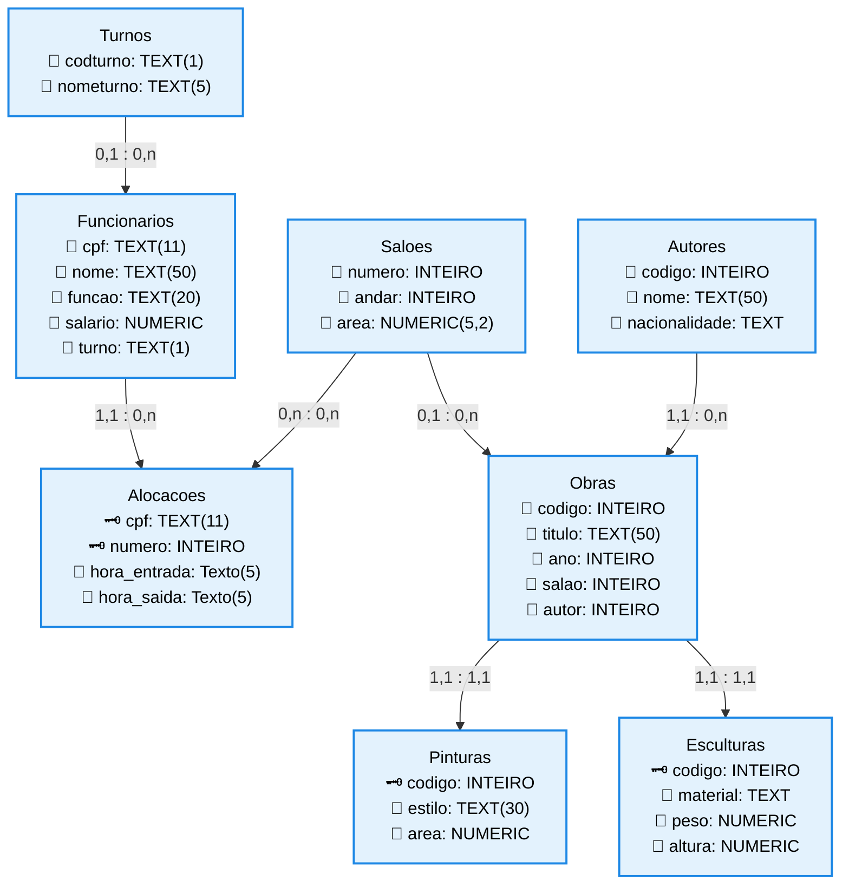

# Roteiro de Pratica e Consultas do Minimundo Empresa

Este documento apresenta o organograma relacional das entidades, o script DDL completo para a criacao do esquema de banco de dados baseado no modelo logico fornecido e a resolucao tecnica de todas as consultas solicitadas. 

## 1. Organograma de Relacionamentos do Banco



## 2. Matriz de Dependencias Estruturais (Ordem de Criacao)

```text

Ordem de Execucao      Tabela Alvo             Motivo da Precedencia Tecnica
1                      turnos                  Entidade forte; nao possui chaves estrangeiras
2                      saloes                  Entidade forte; nao possui chaves estrangeiras
3                      autores                 Entidade forte; nao possui chaves estrangeiras
4                      funcionarios            Depende de turnos (Chave Estrangeira FK)
5                      alocacoes               Tabela associativa; depende de funcionarios e saloes
6                      obras                   Depende de saloes e autores
7                      pinturas                Especializacao de obras (Compartilha chave primaria PK/FK)
8                      esculturas              Especializacao de obras (Compartilha chave primaria PK/FK)

```

## 3. Script SQL DDL de Criacao das Tabelas

```sql

-- 1. Criacao da tabela Turnos
CREATE TABLE turnos (
    codturno CHAR(1) PRIMARY KEY,
    nometurno VARCHAR(5) NOT NULL
);

-- 2. Criacao da tabela Funcionarios
CREATE TABLE funcionarios (
    cpf CHAR(11) PRIMARY KEY,
    nome VARCHAR(50) NOT NULL,
    funcao VARCHAR(20) NOT NULL,
    salario NUMERIC(12,2) NOT NULL,
    turno CHAR(1),
    CONSTRAINT fk_funcionarios_turnos FOREIGN KEY (turno) REFERENCES turnos (codturno)
);

-- 3. Criacao da tabela Saloes
CREATE TABLE saloes (
    numero INT PRIMARY KEY,
    andar INT NOT NULL,
    area NUMERIC(5,2) NOT NULL
);

-- 4. Criacao da tabela Alocacoes
CREATE TABLE alocacoes (
    cpf CHAR(11),
    numero INT,
    hora_entrada CHAR(5) NOT NULL,
    hora_saida CHAR(5) NOT NULL,
    CONSTRAINT pk_alocacoes PRIMARY KEY (cpf, numero),
    CONSTRAINT fk_alocacoes_funcionarios FOREIGN KEY (cpf) REFERENCES funcionarios (cpf),
    CONSTRAINT fk_alocacoes_saloes FOREIGN KEY (numero) REFERENCES saloes (numero)
);

-- 5. Criacao da tabela Autores
CREATE TABLE autores (
    codigo INT PRIMARY KEY,
    nome VARCHAR(50) NOT NULL,
    nacionalidade VARCHAR(50) NOT NULL
);

-- 6. Criacao da tabela Obras
CREATE TABLE obras (
    codigo INT PRIMARY KEY,
    titulo VARCHAR(50) NOT NULL,
    ano INT NOT NULL,
    salao INT,
    autor INT NOT NULL,
    CONSTRAINT fk_obras_saloes FOREIGN KEY (salao) REFERENCES saloes (numero),
    CONSTRAINT fk_obras_autores FOREIGN KEY (autor) REFERENCES autores (codigo)
);

-- 7. Criacao da tabela Pinturas (Especializacao de Obras)
CREATE TABLE pinturas (
    codigo INT PRIMARY KEY,
    estilo VARCHAR(30) NOT NULL,
    area NUMERIC(5,2) NOT NULL,
    CONSTRAINT fk_pinturas_obras FOREIGN KEY (codigo) REFERENCES obras (codigo) ON DELETE CASCADE
);

-- 8. Criacao da tabela Esculturas (Especializacao de Obras)
CREATE TABLE esculturas (
    codigo INT PRIMARY KEY,
    material VARCHAR(30) NOT NULL,
    peso NUMERIC(6,2) NOT NULL,
    altura NUMERIC(4,2) NOT NULL,
    CONSTRAINT fk_esculturas_obras FOREIGN KEY (codigo) REFERENCES obras (codigo) ON DELETE CASCADE
);

```

## 4. Script SQL DQL das Consultas Solicitadas

```sql

-- Consulta 1: Listar o conteudo da tabela de autores
SELECT * FROM autores;

-- Consulta 2: Listar o nome e a nacionalidade de todos os autores
SELECT nome, nacionalidade FROM autores;

-- Consulta 3: Listar CPF, nome, salario e salario anual dos funcionarios
SELECT cpf, nome, salario, (salario * 12) AS "Salário Anual" FROM funcionarios;

-- Consulta 4: Listar o nome do autor concatenado com a sua nacionalidade com o alias de coluna nome e nacionalidade
SELECT nome || ' - ' || nacionalidade AS "nome e nacionalidade" FROM autores;

-- Consulta 5: Listar o nome do autor concatenado com a sua nacionalidade (Sem alias explicito)
SELECT nome || ' - ' || nacionalidade FROM autores;

-- Consulta 6: Listar a area media com o alias area media, e numero de saloes com o alias 'Total de saloes'
SELECT AVG(area) AS "área média", COUNT(*) AS "Total de salões" FROM saloes;

-- Consulta 7: Listar o total de pinturas com o alias 'Quantidade de pinturas'
SELECT COUNT(*) AS "Quantidade de pinturas" FROM pinturas;

-- Consulta 8: Listar o maior peso de uma escultura
SELECT MAX(peso) AS "Maior Peso" FROM esculturas;

-- Consulta 9: Listar o titulo de uma obra que aparece primeiro na ordem alfabetica crescente
SELECT titulo FROM obras ORDER BY titulo ASC LIMIT 1;

```
