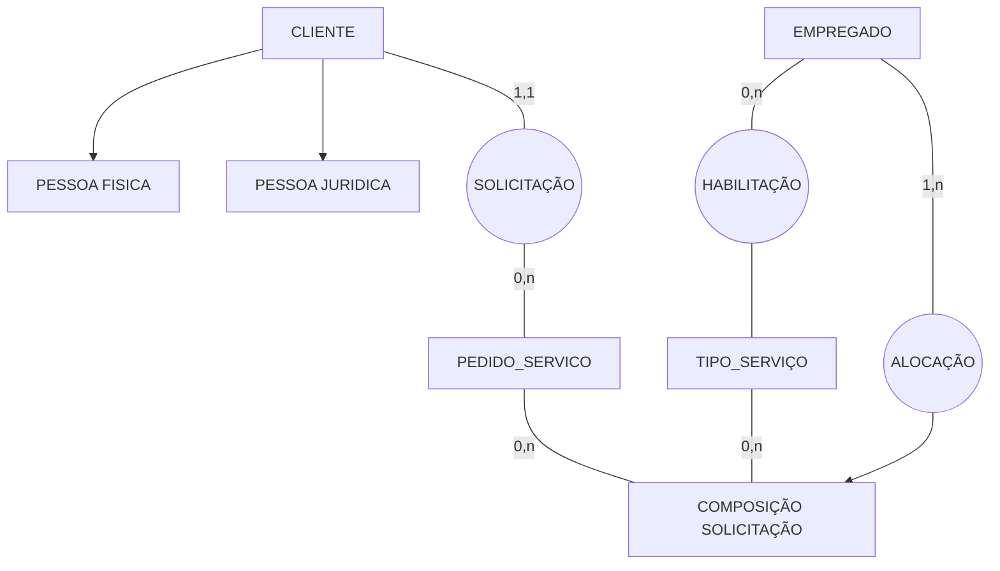

# Diagrama Entidade-Relacionamento (DER): DER na Prática

## 1. Minimundo e Requisitos da Empresa de Limpeza

A aplicação prática dos conceitos de modelagem conceitual é demonstrada através do mapeamento das regras de negócio da firma "Serviços Domésticos", cujo objetivo central é gerenciar pedidos e a alocação de empregados para serviços de limpeza. 

* **Cadastro de Clientes:** 

  * Cada cliente recebe um código identificador único atribuído pela firma.
  * O modelo deve suportar dois tipos de clientes: Pessoas Jurídicas (exigindo CNPJ e Razão Social) e Pessoas Físicas (exigindo CPF e Nome).
  * Ambos os tipos compartilham propriedades comuns como endereço e telefone.
* **Processamento de Pedidos:** 

  * Ao abrir um pedido de serviços, registram-se: número do pedido, nome do cliente, data de abertura, data prevista para realização, local de execução e a descrição dos serviços com suas respectivas metragens quadradas (m²).
  * O sistema calcula a duração máxima e o valor total com base em uma tabela fixa de serviços (que contém o código do serviço, descrição, valor por m² e duração por m²).
* **Alocação de Empregados:** 

  * Cada empregado possui habilitação para executar pelo menos um tipo de serviço de limpeza.
  * O sistema possui uma restrição rígida: um empregado só pode ser alocado para realizar um serviço específico de um pedido se ele for previamente habilitado para aquele tipo de serviço.
  * Cada empregado realiza no máximo um serviço dentro de um mesmo pedido.

## 2. Roteiro Metodológico para Modelagem Conceitual

Para converter a descrição textual do mundo real em um Diagrama Entidade-Relacionamento (DER) consistente, deve-se seguir rigorosamente o seguinte roteiro de passos: 

1. Identificar as entidades independentes e persistentes contidas no texto.
2. Definir as entidades tipo e desenhá-las no diagrama utilizando retângulos.
3. Identificar as associações e regras lógicas de conexão existentes entre as entidades.
4. Definir os relacionamentos tipo e desenhá-los no diagrama utilizando losangos.
5. Estabelecer e validar os pares ordenados de cardinalidade mínima e máxima para cada vínculo.
6. Aplicar a cardinalidade inversa nas linhas de conexão conforme as convenções de design.
7. Verificar a necessidade de componentes avançados do modelo estendido, como estruturas de especialização/generalização (supertipos e subtipos) ou entidades associativas (agregações).
8. Identificar, classificar e ligar todos os atributos (identificadores, obrigatórios, opcionais ou compostos) aos seus respectivos elementos.

### 3. Mapeamento de Estruturas Avançadas no Estudo de Caso

O minimundo da empresa de limpeza exige a aplicação de conceitos avançados do modelo estendido para refletir fielmente as regras de negócio declaradas: 

* **Aplicação de Especialização/Generalização:** 

  * A entidade CLIENTE atua como o supertipo genérico da estrutura.
  * O modelo deriva duas entidades especializadas (subtipos): PESSOA_FISICA e PESSOA_JURIDICA.
  * As entidades filhas herdam o código identificador, endereço e telefone do supertipo, mas isolam seus atributos exclusivos (CPF/Nome vs. CNPJ/Razão Social).
* **Demanda para Entidade Associativa:** 

  * Existe uma relação base entre as tabelas de pedidos e o catálogo de serviços para compor os itens solicitados pelo cliente.
  * A alocação de um EMPREGADO não ocorre para o pedido como um todo e nem para o serviço genérico, mas sim para a linha exata de um serviço específico que foi incluído dentro daquele pedido determinado.
  * Para solucionar o impasse técnico de conectar a entidade EMPREGADO a uma relação existente, o vínculo entre pedido e serviço deve ser encapsulado sob a forma de uma **Entidade Associativa**, permitindo que ela receba a nova conexão de alocação de funcionários com segurança lógica.

