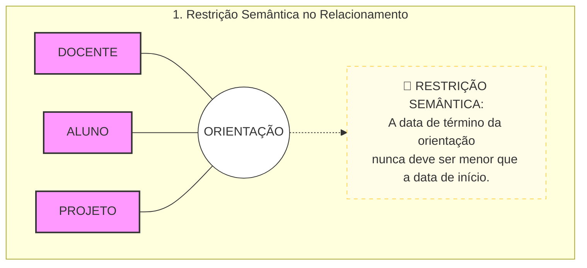
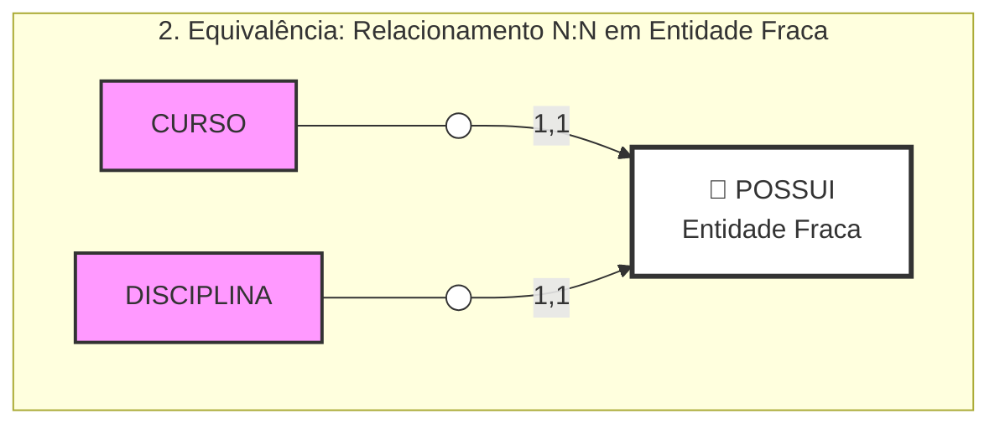
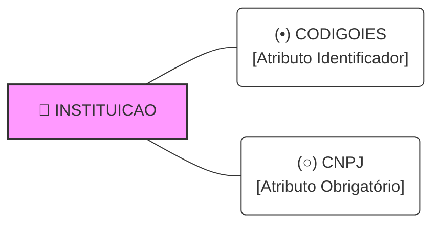

# Processo de Modelagem de Entidades e Relacionamentos

## 1. Objetivos do DER e Restrições de Integridade

O Diagrama Entidade-Relacionamento (DER) funciona como uma ferramenta de documentação e alinhamento, garantindo que profissionais de TI e colaboradores tenham a mesma compreensão sobre o negócio, minimizando a curva de aprendizado sobre a organização. 

* **Restrições de Integridade:** São regras lógicas que devem ser obedecidas e forçadas pelo SGBD em relação ao banco de dados. Podem ser expressas diretamente por elementos do DER (como a cardinalidade de um atributo).
* **Restrições Semânticas:** São restrições de negócio complexas que não possuem um elemento gráfico específico no DER. Devem ser documentadas em separado, utilizando linguagem natural escrita diretamente no modelo. 

  * *Exemplo Prático:* Em um relacionamento de orientação de projetos, a regra estabelece que a "data de término da orientação nunca deve ser menor que a data de início". Essa condição envolve dois atributos e é descrita em formato de texto no diagrama.
* **Equivalência entre Modelos:** Segundo a literatura técnica (HEUSER, 2009), dois modelos de dados distintos são considerados equivalentes quando ambos, ao final do processo de conversão, geram exatamente o mesmo esquema de banco de dados.

---

## 2. Transformação de Relacionamentos N:N em Entidade Fraca

Todo relacionamento de muitos para muitos (N:N) pode ser convertido em uma estrutura equivalente baseada em entidades, facilitando o mapeamento lógico e a quebra de complexidade do modelo original. 

* **Roteiro de Etapas para a Conversão:** 

  1. Representar o relacionamento N:N original sob o formato de uma nova entidade (ex: o vínculo POSSUI transforma-se na entidade POSSUI).
  2. Criar linhas de relacionamento ligando a nova entidade diretamente às entidades que participavam da associação original (ligar POSSUI a CURSO e DISCIPLINA).
  3. Adicionar à nova entidade todos os atributos que porventura existissem no relacionamento original (caso não existam, a entidade permanece sem atributos próprios).
  4. Definir que a nova entidade será identificada de forma dependente através dos relacionamentos com as tabelas pai. Graficamente, isso é representado no DER por **linhas de conexão mais espessas**.
  5. Estabelecer obrigatoriamente a cardinalidade unitária (1,1) na saída da nova entidade para cada um dos relacionamentos vinculados a ela.
* **O Conceito de Entidade Fraca:** 

  * Uma ocorrência do relacionamento transformado só pode ser salva no banco de dados se houver a existência concomitante de um registro válido em cada entidade pai.
  * Essa dependência de existência caracteriza a nova estrutura como uma **entidade fraca**, cujo ciclo de vida e identificação dependem estritamente de outras entidades do sistema.

---

## 3. Modelagem de Entidade Isolada

Existem cenários onde o banco de dados armazena informações institucionais globais que não precisam ser vinculadas a registros operacionais do dia a dia do sistema. 

* **Definição Técnica:** Segundo Heuser (2009), uma entidade isolada é aquela que não apresenta nenhuma linha de relacionamento ou associação com as demais entidades contidas no Diagrama Entidade-Relacionamento.
* **Caso de Uso Prático (IES Única):** 

  * Quando o DER é projetado para gerenciar o funcionamento de uma única e exclusiva Instituição de Ensino Superior (IES), não há necessidade de vincular cada aluno ou curso à instituição, pois o contexto geral já é subentendido.
  * Para armazenar os dados fixos e corporativos da organização, adiciona-se uma entidade isolada chamada INSTITUICAO.
  * *Expansão do Bloco:* Esse bloco isolado armazena atributos globais como Código identificador, CNPJ, Razão Social, Data de Criação e Telefone. Caso o negócio evolua e exija novas propriedades da IES, basta anexar novos atributos diretamente a essa caixa, mantendo-a isolada no modelo.
 

