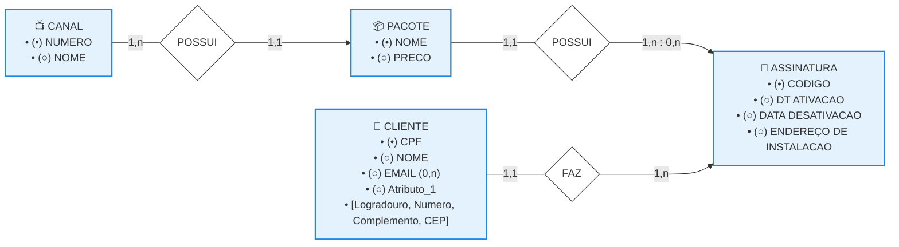

### Modelo Entidade-Relacionamento: Modelagem na Prática (Estudo de Caso TV a Cabo)

### 1. Abordagem Metodológica para Casos de Uso

A resolução prática de um problema de modelagem de dados a partir de um minimundo descritivo exige a quebra do texto em componentes atômicos. O processo deve seguir rigorosamente um roteiro estruturado de quatro passos fundamentais. 

* **Passo 1:** Identificar no texto descritivo todas as entidades tipo (objetos com existência independente) e representá-las graficamente no modelo utilizando retângulos.
* **Passo 2:** Identificar no texto descritivo os relacionamentos tipo (as interações e associações de negócios) e desenhá-los no diagrama por meio de losangos.
* **Passo 3:** Estabelecer e validar os pares ordenados de cardinalidade mínima e máxima para cada ponta dos relacionamentos mapeados.
* **Passo 4:** Modelar e anexar detalhadamente os atributos (identificadores, obrigatórios ou opcionais) aos seus respectivos elementos.

### 2. Organograma Lógico do DER (Solução TV a Cabo)

Abaixo está o diagrama estrutural que mapeia o ecossistema de faturamento, assinaturas e serviços da empresa de TV a Cabo, garantindo a integridade referencial do sistema de cobrança automatizado. 

### 3. Dicionário e Regras de Negócio do Diagrama

O fluxo operacional do sistema de cobrança automatizado distribui-se em três eixos de associação lógicas fundamentais expressas pelas caixas do organograma: 

* **Eixo de Assinatura (ASSINANTE e CONTRATO):** 

  * Um assinante pode possuir um ou vários contratos ativos ou históricos com a empresa (1,n).
  * Cada contrato deve estar vinculado obrigatoriamente a um único assinante responsável pelo faturamento (1,1).
* **Eixo de Pacotes (CONTRATO e PLANO_SERVIÇO):** 

  * Um plano de serviço pode estar presente em zero ou múltiplos contratos da base de clientes (0,n).
  * Cada contrato adere obrigatoriamente a pelo menos um plano de serviço específico oferecido pela operadora (1,1).
* **Eixo de Faturamento (CONTRATO e FATURA_COBRANÇA):** 

  * Um contrato gera, ao longo do tempo, uma série histórica de faturas mensais de cobrança (1,n).
  * Cada fatura de cobrança é gerada e emitida de forma exclusiva contra um único contrato correspondente no sistema (1,1).
