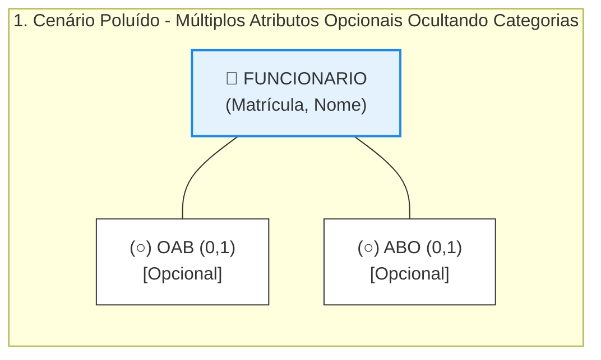
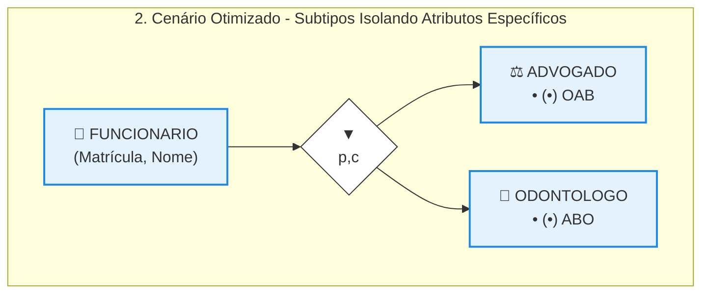

# Modelagem de Atributos: Atributo Opcional

## 1. O Problema da Acumulação de Atributos Opcionais

A determinação de um atributo como obrigatório ou opcional é uma decisão estratégica que molda a rigidez do sistema, influenciando diretamente a integridade e a consistência dos dados armazenados. 

* **Surgimento de Campos Opcionais:** Em cenários de negócios em expansão, é comum a necessidade de adicionar novas propriedades específicas a uma entidade genérica (como a entidade FUNCIONARIO).
* **O Caso Prático (Inclusão de Registros Profissionais):** Suponha que o sistema passe a exigir o armazenamento do número de registro da Ordem dos Advogados do Brasil (OAB) ou da Associação Brasileira de Odontologia (ABO) para os funcionários da instituição.
* **A Poluição Semântica no Modelo:** Ao inserir os campos OAB e ABO diretamente na tabela FUNCIONARIO como atributos opcionais (0,1), o modelo perde clareza e fidelidade, gerando os seguintes problemas técnicos: 

  * *Ambiguidade de Regras:* O diagrama não consegue expressar visualmente quais combinações desses campos são válidas (ex: se um funcionário pode ter ambos os registros preenchidos, ou se o preenchimento de um anula o outro).
  * *Proliferação de Campos Nulos (*Nulls*):* Para funcionários administrativos comuns, que não são advogados nem dentistas, ambos os campos ficarão vazios na base de dados, desperdiçando recursos estruturais do SGBD.

## 2. Resolução do Impasse por Meio de Especialização

Sempre que uma entidade começar a acumular múltiplos atributos opcionais que pertencem apenas a subgrupos específicos de registros, o projetista deve investigar se esses atributos estão ocultando categorias ou subtipos ocultos no negócio. 

* **Identificação das Categorias Ocultas:** No estudo de caso, os atributos opcionais OAB e ABO denunciam claramente a existência de duas funções ou profissões distintas dentro da folha de pagamento: Advogados e Odontólogos.
* **Ajuste Arquitetural:** A solução ideal consiste em remover os atributos opcionais da tabela pai e promover essas categorias a entidades especializadas (subtipos) conectadas ao supertipo genérico FUNCIONARIO.
* **Vantagens da Abordagem Especializada:** 

  * *Fidelidade ao Mundo Real:* O diagrama passa a representar o negócio de forma muito mais precisa e compreensível para qualquer leitor.
  * *Eliminação de Atributos Opcionais Genéricos:* A tabela FUNCIONARIO é limpa de campos vazios desnecessários.
  * *Restrições de Obrigatoriedade:* Nas tabelas filhas ADVOGADO e ODONTOLOGO, os atributos OAB e ABO deixam de ser opcionais e passam a ser **monovalorados e obrigatórios (1,1)**, pois todo advogado cadastrado deve, obrigatoriamente, possuir uma carteira da OAB ativa.

