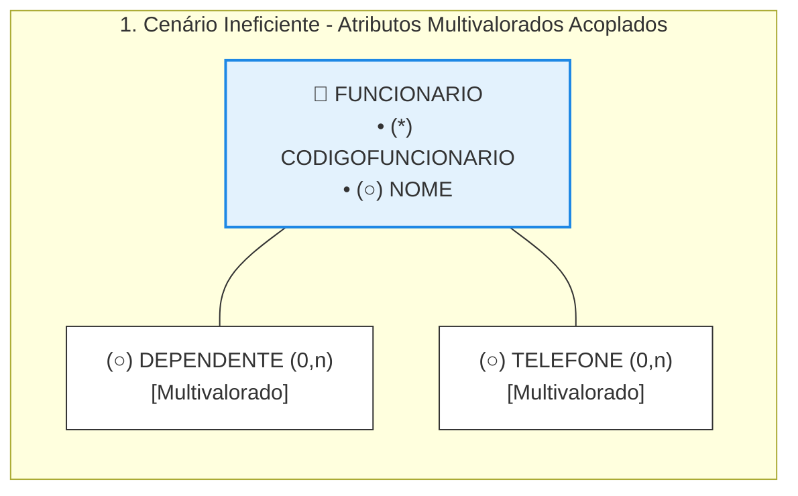
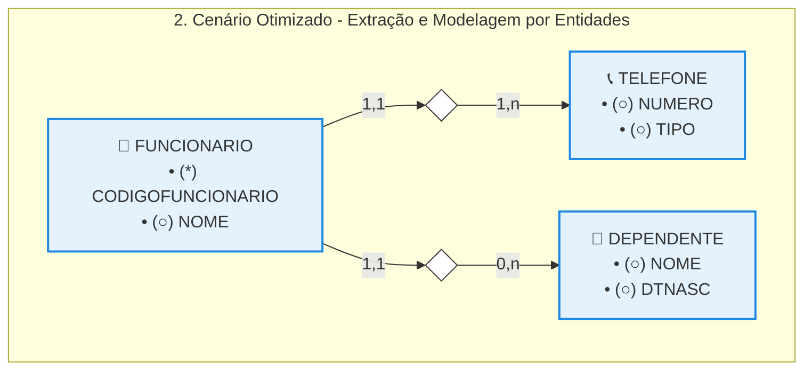

# Modelagem de Atributos: Atributo Multivalorado

## 1. O Impacto de Atributos Multivalorados no Modelo Relacional

A determinação de um atributo como multivalorado — aquele que permite armazenar múltiplos valores diferentes para uma mesma ocorrência de entidade — exige cautela do projetista, pois entra em conflito direto com as regras de normalização dos bancos de dados tradicionais. 

* **Cenário Primitivo (Mapeamento por Atributo):** Ao surgir a regra de negócio de que um funcionário pode possuir vários dependentes ou múltiplos telefones de contato, a primeira abordagem intuitiva é desenhar os campos DEPENDENTE e TELEFONE como atributos multivalorados (0,n) conectados à entidade pai FUNCIONARIO.
* **Motivos Críticos para Evitar essa Modelagem:** 

  * *Incompatibilidade Física:* SGBDs relacionais puros não possuem uma forma de implementação direta e nativa para colunas que guardam listas ou múltiplos valores por célula (violação da Primeira Forma Normal - 1FN).
  * *Ocultamento de Propriedades (Atributos Escondidos):* Atributos multivalorados simples impedem o detalhamento do objeto. Se o dependente for apenas um campo de texto livre, o sistema fica impossibilitado de isolar e controlar dados essenciais individualizados, como a sua data de nascimento ou o grau de parentesco. Da mesma forma, o telefone perde a capacidade de ser categorizado entre "Fixo", "Celular" ou "Trabalho".

## 2. Solução por Meio de Decomposição em Entidades Relacionadas

A melhor prática de engenharia de dados consiste em extrair os atributos multivalorados da entidade genérica e promovê-los a entidades fracas ou dependentes de existência, conectadas através de relacionamentos explícitos de um para muitos (1:N). 

* **Evolução Estrutural (Modelo Otimizado):** O objeto de dados decompõe-se em três blocos independentes e conectados horizontal e verticalmente: 

  * *Entidade FUNCIONARIO:* Limpa e isolada, mantendo apenas dados estritamente monovalorados (CODIGOFUNCIONARIO e NOME).
  * *Entidade TELEFONE:* Passa a contar com atributos próprios especializados para qualificar o dado, dividindo a informação em NUMERO e TIPO (categoria do contato).
  * *Entidade DEPENDENTE:* Ganha estrutura completa para gerenciar as propriedades individuais de cada membro familiar, isolando os campos de NOME e DTNASC (Data de Nascimento).
* **Análise de Cardinalidades Reversas:** 

  * Um funcionário pode possuir de zero a vários telefones ou dependentes cadastrados no sistema (0,n).
  * Um número de telefone específico ou um dependente registrado na base pertence obrigatoriamente a um, e no máximo um, funcionário titular cadastrado (1,1).

## 3. Benefícios Técnicos da Nova Arquitetura

A promoção de atributos multivalorados para novas tabelas garante vantagens competitivas imediatas para o ciclo de vida do projeto: 

* **Legibilidade e Precisão:** O modelo expressa as verdadeiras regras de negócio do minimundo de forma clara, eliminando ambiguidades estruturais.
* **Escalabilidade Sem Impacto:** Caso a organização passe a exigir novas informações (como o e-mail do dependente ou a operadora do telefone), basta anexar novos atributos diretamente às caixas correspondentes, de maneira natural e sem a necessidade de reestruturar a tabela principal de funcionários.
