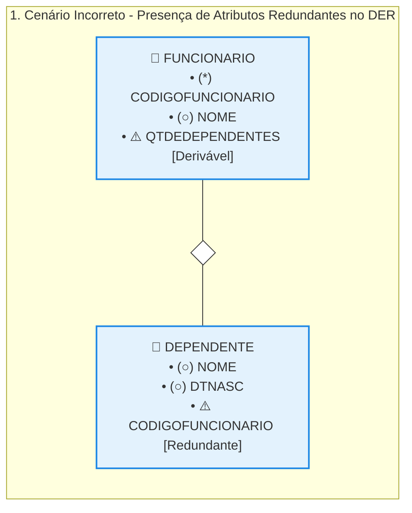
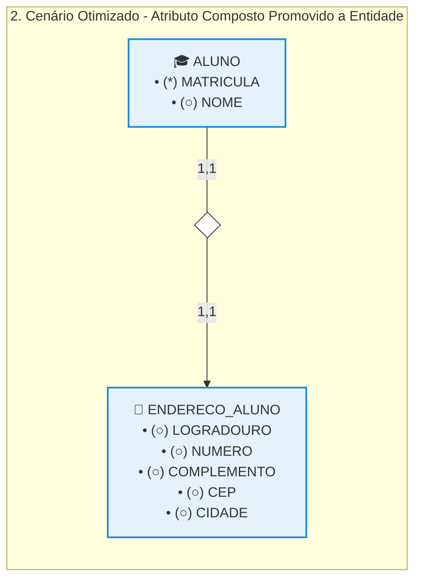

# Modelagem de Atributos: Atributos Redundantes e Compostos

## 1. O Impacto dos Atributos Redundantes no DER

A inclusão de dados deriváveis ou repetidos na fase de modelagem conceitual cria ambiguidades estruturais e gera riscos desnecessários de inconsistência para o banco de dados. 

* **Definição Técnica:** Segundo Heuser (2009), atributos redundantes são aqueles cujos valores podem ser obtidos ou calculados a partir da execução de procedimentos de busca de dados e/ou operações matemáticas sobre outras estruturas já existentes no próprio banco de dados.
* **Análise de Ineficiência do Modelo (Estudo de Caso Funcionário-Dependente):** 

  * *O campo QTDEDEPENDENTES:* Inserir este atributo na entidade FUNCIONARIO é desnecessário. A quantidade exata de familiares associados a um trabalhador pode ser extraída em tempo real por meio de uma operação de contagem (COUNT) no relacionamento que liga as tabelas. Mantê-lo fixo exige criar rotinas extras de código para atualizar o número a cada novo nascimento ou exclusão.
  * *O campo CODIGOFUNCIONARIO na tabela DEPENDENTE:* Inserir manualmente a chave estrangeira ou o código de identificação do pai diretamente como um atributo comum da tabela DEPENDENTE é um erro conceitual no DER. O vínculo e a descoberta de quem é o responsável pelo dependente ocorrem naturalmente através da linha de conexão do relacionamento.
* **Regra de Ouro da Modelagem:** Atributos redundantes **devem ser completamente omitidos** do Diagrama Entidade-Relacionamento. O DER é um modelo abstrato de alto nível que não diferencia um campo nativo de um campo redundante, devendo prezar estritamente pela limpeza e eliminação de duplicidades.

### 2. Atributos Compostos e a Densidade do Modelo

Atributos compostos são aqueles que podem ser divididos em subpartes menores ou atributos básicos, onde cada fragmento possui um significado próprio e independente para o negócio. 

* **O Dilema Visual do Endereço:** Ao mapear a entidade ALUNO, o campo genérico ENDEREÇO costuma ser quebrado em múltiplos subatributos essenciais, tais como Logradouro, Número, Complemento, Bairro, CEP e Cidade.
* **A Desvantagem da Abordagem Direta:** Desenhar todas as ramificações de um endereço conectadas diretamente à bolha principal da entidade gera um diagrama com visual poluído e bastante denso, dificultando a leitura e a escanabilidade do DER por outras equipes.
* **A Solução por Extração de Entidade:** Para limpar o layout e dar mais flexibilidade ao sistema, a melhor prática de engenharia consiste em transformar o objeto alvo do atributo composto em uma **Entidade Relacionada** independente conectada à tabela principal.

## 3. Otimização Arquitetural em Grafos Horizontais

Substituindo o emaranhado de linhas circulares do atributo composto por uma tabela isolada de infraestrutura, o modelo ganha elegância visual e capacidade de expansão nativa. 

* **Vantagens da Decomposição:** 

  * Elimina a poluição visual de múltiplos círculos ao redor do Aluno.
  * Permite que o endereço armazene novas propriedades no futuro de forma natural.
  * Facilita a portabilidade, caso a regra de negócio mude e permita que um aluno registre mais de um endereço no sistema (como endereço residencial e de cobrança).

