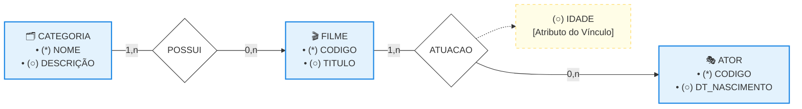

# Modelagem de Atributos: Modelagem de Atributos na Prática

## 1. Análise do Minimundo do Sistema de Cinema

A aplicação dos conceitos de engenharia de dados e classificação de propriedades é demonstrada por meio do estudo de caso de um sistema de acervo de cinema, cujo foco é gerenciar filmes, seus elencos e classificações de gênero. 

* **Requisitos dos Filmes:** Cada produção cinematográfica é registrada obrigatoriamente por meio de um código identificador exclusivo e um título descritivo.
* **Garantia de Padronização de Categorias:** O sistema exige que todo filme pertença a uma classificação de gênero (como comédia ou suspense). Para evitar erros de digitação e duplicidades de texto livre, o objeto foi promovido à entidade CATEGORIA, contendo um código de identificação próprio e uma descrição padrão.
* **Mapeamento do Elenco e Características dos Atores:** O banco de dados deve registrar informações individualizadas sobre os atores, capturando o nome real e a data de nascimento como propriedades nativas e persistentes.
* **Rastreabilidade Dinâmica das Atuações:** O sistema armazena uma propriedade temporal específica que depende estritamente da união entre o profissional e a obra: a idade com que o ator realizou aquela gravação.

## 2. Organograma Lógico do DER (Solução Cinema)

Abaixo está o diagrama estrutural e lógico do estudo de caso, modelado horizontalmente com a paleta de cores azulada e com a sintaxe Mermaid compatível com o seu visualizador de Markdown. 

## 3. Classificação e Análise Técnica dos Atributos do Modelo

O refinamento e a validação do Diagrama Entidade-Relacionamento exigem que cada propriedade seja classificada minuciosamente de acordo com as diretrizes do roteiro de prática: 

* **Atributos Identificadores (Únicos e Obrigatórios):** Mapeados graficamente no diagrama por meio do círculo totalmente preenchido. 

  * *Campos:* CÓDIGO (na entidade ATOR), CÓDIGO (na entidade FILME) e NOME (na entidade CATEGORIA). Garantem a unicidade absoluta de cada linha de registro na base de dados.
* **Atributos Descritivos (Não Únicos e Obrigatórios):** Mapeados por círculos vazados sem cardinalidade expressa, aplicando a convenção do padrão monovalorado (1,1). 

  * *Campos:* TÍTULO (em FILME), DESCRIÇÃO (em CATEGORIA) e DT_NASCIMENTO (em ATOR).
* **Atributos de Relacionamento (Propriedades do Vínculo):** 

  * *O campo IDADE:* Está conectado diretamente ao losango ATUACAO. Esta decisão é um critério de projeto essencial: a idade do ator muda a cada ano, mas a idade com que ele gravou aquele filme específico é um fato histórico imutável e pertence estritamente à intersecção entre o ator e a obra.
* **Análise das Restrições de Cardinalidade Reversas:** 

  * *Vínculo FILME - CATEGORIA:* Uma categoria de gênero pode agrupar de um a vários filmes cadastrados (1,n). Por outro lado, um filme pertence a zero ou a no máximo uma categoria específica no sistema (0,n).
  * *Vínculo FILME - ATOR:* Um filme cadastrado na base de dados pode contar com a atuação de um a vários atores principais (1,n). Em contrapartida, de acordo com as regras do minimundo (*"nem todos os filmes têm atores principais"*), um ator pode participar de zero a várias produções da empresa (0,n).
