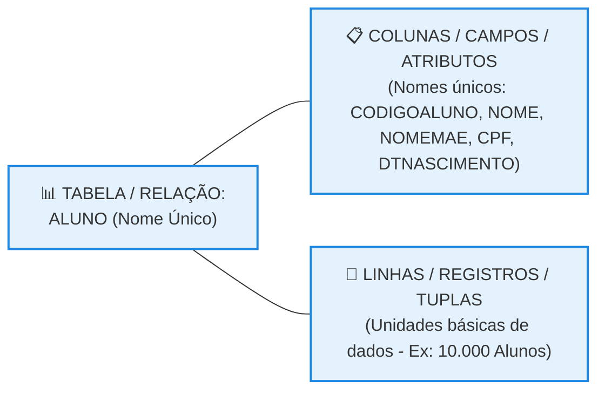

# Modelo Relacional e Componentes Básicos de uma Tabela

## 1. Fundamentos do Modelo Relacional e Nomenclaturas

O modelo relacional organiza e gerencia as informações de um ambiente digital estruturando os dados de forma lógica e padronizada. Na literatura técnica e acadêmica, existem termos formais que encontram equivalências diretas no uso comercial do dia a dia. 

* **Relação vs. Tabela:** O termo científico "Relação" (ELMASRI; NAVATHE, 2019) é tratado informalmente no mercado como **Tabela**. O banco de dados relacional é definido como uma coleção dessas relações.
* **Tupla vs. Linha/Registro:** Uma linha da tabela corresponde à unidade básica de armazenamento e recuperação, sendo denominada formalmente como **Tupla**.
* **Atributo vs. Coluna/Campo:** Os cabeçalhos e divisões verticais que fragmentam os registros lógicos recebem o nome acadêmico de **Atributo**.
* **Unicidade de Identificação:** Em um banco de dados relacional, toda e qualquer tabela precisa possuir um nome único e exclusivo. A maioria dessas tabelas é gerada a partir do mapeamento direto das entidades validadas em um Diagrama Entidade-Relacionamento (DER).
* **Consistência Semântica:** O nome da tabela deve representar o objeto modelado com clareza. Uma tabela chamada ALUNO deve armazenar estritamente registros de alunos, sendo semanticamente incorreto utilizá-la para guardar dados de professores, cursos ou disciplinas.

## 2. Propriedades e Restrições de Colunas

As colunas definem a estrutura, o comportamento e os limites dos dados que o sistema pode aceitar em cada campo vertical da tabela. 

* **Atomicidade dos Valores:** As colunas de um banco de dados relacional admitem exclusivamente valores atômicos. Isso significa que as informações não podem ser subdivididas em outros subcampos internos (ex: o campo CODIGOALUNO é indivisível).
* **Restrição Monovalorada:** É permitido manter no máximo um único item de informação por vez em cada célula. Cada registro pode conter apenas uma ocorrência de data no campo DTNASCIMENTO.
* **Domínio da Coluna:** Caracteriza-se como o conjunto total de valores válidos que uma determinada coluna pode assumir. Na implementação prática no SGBD, o projetista restringe esse domínio associando um tipo de dado específico a cada coluna, sendo os mais comuns: 

  * Caractere (Texto / *String*)
  * Numérico (Inteiro / *Float*)
  * Data (*Date* / *Timestamp*)
  * Booleano (Verdadeiro / Falso)

## 3. Dinâmica das Linhas e Tratamento de Valores Nulos

Cada linha adicionada à tabela armazena uma ocorrência real do minimundo e deve respeitar as restrições de obrigatoriedade configuradas no projeto. 

* ** Unidade de Armazenamento:** Se uma tabela possui 10.000 linhas cadastradas, significa que ela gerencia e armazena os dados individuais de exatamente 10.000 alunos distintos.
* **Obrigatoriedade vs. Opcionalidade:** Durante a criação das colunas, deve-se explicitar se o preenchimento daquela informação é mandatório ou opcional para o sistema.
* **O Conceito de Vazio (NULL):** Especificar que uma coluna é opcional significa que suas células admitem a ausência de valor, representada tecnicamente pelo marcador **NULL** ou nulo. 

  * *Exemplo Prático (Análise da Imagem):* Na tabela de exemplo ALUNO, a coluna NOMEMAE foi configurada como opcional. Por esse motivo, a linha correspondente à aluna de código 1 (Aline Gonçalves Campos) pôde ser salva com o campo da mãe em branco (vazio/NULL), sem violar as regras de integridade do SGBD.
 
## Tabela Exemplo: ALUNO

CODIGOALUNO | NOME                   | NOMEMAE                 | CPF         | DTNASCIMENTO
------------|------------------------|-------------------------|-------------|-------------
1           | Aline Goncalves Campos | NULL                    | 09320900022 | 13/02/1980
2           | Pablo Goncalves Campos | Maria Augusta Goncalves | 08760900022 | 13/12/1984
3           | Bruno da Silva         | Yvone Silva             | 99920900099 | 15/02/1990
4           | Viviane da Silva       | Yvone Silva             | 00209000922 | 15/07/1994
5           | Lucas Pontes Silva     | Daniele Pontes Maciel   | 11109000933 | 15/07/1994
