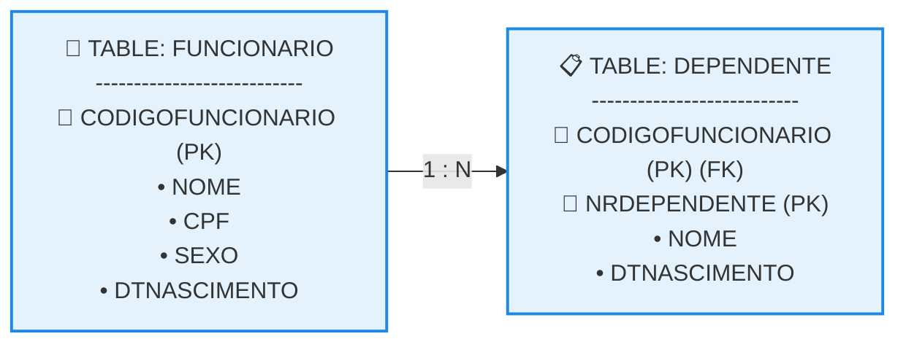

# Esquema Diagramático e Textual

## 1. O Esquema Diagramático na Notação Pé de Galinha (*Crow's Foot*)

O esquema diagramático de um banco de dados relacional funciona como um mapa arquitetural visual que traduz a complexidade organizacional dos dados, revelando as interconexões físicas existentes entre tabelas, atributos e chaves de integridade. 

* **Estrutura dos Blocos Gráficos:** As ferramentas de modelagem comercial utilizam convenções visuais padronizadas para representar o banco. Na notação pé de galinha, o design organiza-se da seguinte forma: 

  * Cada tabela do sistema é representada por um retângulo dividido verticalmente em seções.
  * Na primeira subdivisão (topo), adiciona-se o nome de identificação exclusivo da tabela.
  * Na subdivisão subsequente (corpo), listam-se todas as colunas com seus respectivos nomes e tipos de dados.
* **Mapeamento de Restrições e Símbolos:** O diagrama estampa marcadores explícitos ao lado do nome dos campos para indicar o seu papel estrutural: 

  * **PK (Primary Key):** Sinaliza a coluna ou o par de colunas que atua como chave primária.
  * **FK (Foreign Key):** Sinaliza o campo de vínculo que atua como chave estrangeira.
* **Representação de Cardinalidade:** A linha de conexão que une as tabelas carrega símbolos nas extremidades. A ramificação de três linhas "colada" na borda de uma tabela assemelha-se a um pé de galinha e representa o lado **N (Vários)** daquele relacionamento.

## 2. O Esquema Textual de Banco de Dados Relacional

Como alternativa ao modelo puramente gráfico, o banco de dados e suas restrições de integridade referencial podem ser declarados e documentados de maneira compacta sob o formato de esquema textual padronizado. 

* **Regras de Sintaxe e Declaração Textual:** A transcrição do modelo de dados para o formato de texto segue convenções internacionais rígidas de escrita: 

  * Cada tabela é declarada exibindo o seu nome em letras maiúsculas, seguido imediatamente por uma lista entre parênteses contendo todas as suas respectivas colunas separadas por vírgula.
  * As colunas eleitas para atuar como chaves primárias (sejam simples ou compostas) devem ser identificadas obrigatoriamente por meio de um **sublinhado**.
  * As chaves estrangeiras são declaradas logo abaixo da tabela correspondente, utilizando a sintaxe padrão: nome_da_coluna_fk REFERENCIA nome_da_tabela_pai.
* **Mapeamento Textual do Estudo de Caso (Funcionário vs. Dependente):** Aplicando essas diretrizes de engenharia de dados ao minimundo analisado, o esquema consolida-se na seguinte estrutura:

text

FUNCIONARIO (CODIGOFUNCIONARIO, NOME, CPF, SEXO, DTNASCIMENTO)

DEPENDENTE (CODIGOFUNCIONARIO, NRDEPENDENTE, NOME, DTNASCIMENTO)
   CODIGOFUNCIONARIO REFERENCIA FUNCIONARIO

Use o código com cuidado.
