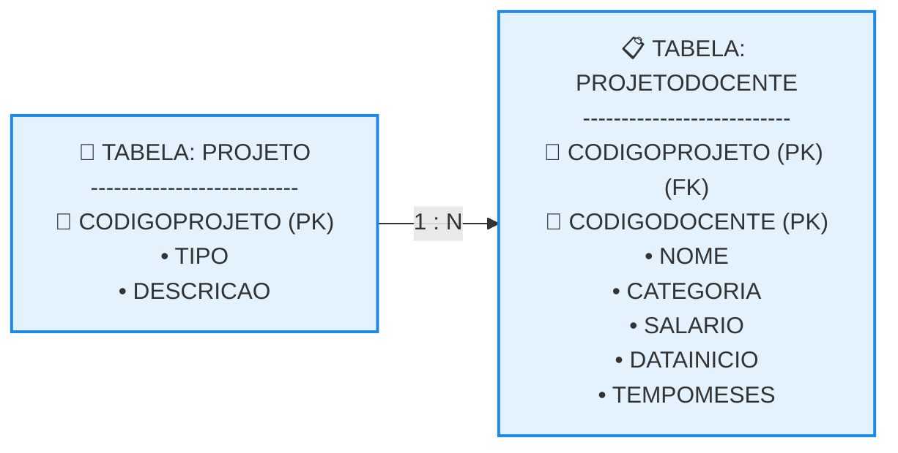

# Primeira Forma Normal (1FN)

## 1. O Conceito da 1FN e a Divisão de Tabelas (PROJETO e PROJETODOCENTE)

Uma tabela está na Primeira Forma Normal (1FN) quando todas as suas colunas contêm apenas valores atômicos (indivisíveis) e monovalorados. Na prática, a aplicação da 1FN exige a eliminação completa de atributos compostos e grupos repetitivos aninhados. 

* **A Regra de Decomposição:** Para normalizar a Tabela Não Normalizada (TNN) vista anteriormente, isolamos os dados do projeto em uma estrutura própria e criamos uma tabela intermediária para gerenciar as alocações dos docentes.
* **A Tabela PROJETO:** Fica responsável exclusivamente pelos dados do projeto científico. Sua chave primária é simples (CODIGOPROJETO).
* **A Tabela PROJETODOCENTE:** Reúne os dados do grupo repetitivo (docentes e tempos de alocação). Como um docente pode estar em vários projetos e um projeto tem vários docentes, a identificação exige uma **Chave Primária Composta** formada pelo par (CODIGOPROJETO, CODIGODOCENTE).

### Esquema Textual na 1FN

```text

PROJETO (CODIGOPROJETO, TIPO, DESCRICAO)

PROJETODOCENTE (CODIGOPROJETO, CODIGODOCENTE, NOME, CATEGORIA, SALARIO, DATAINICIO, TEMPOMESES)
   CODIGOPROJETO REFERENCIA PROJETO

```

### Estrutura das Tabelas Físicas (Texto Puro)

**Tabela: PROJETO** 

```text

CODIGOPROJETO (PK) | TIPO             | DESCRICAO
-------------------|------------------|--------------------------------------------------
PRODATA            | ANÁLISE DE DADOS | DESENVOLVIMENTO DE AMBIENTE PARA ANÁLISE DE DADOS
PROMED             | ANÁLISE CLÍNICA  | ATENDIMENTO COMUNITÁRIO E VACINAÇÃO
```

**Tabela: PROJETODOCENTE** 

```text

CODPROJ (PK)(FK) | CODDOC (PK) | NOME    | CATEGORIA | SALARIO    | DTINICIO   | TEMPO
-----------------|-------------|---------|-----------|------------|------------|------
PRODATA          | DOC001      | JOSÉ    | ADJUNTO   | R$ 6000,00 | 01/02/2019 | 16
PRODATA          | DOC002      | LUCIANO | TITULAR   | R$ 16000,00| 01/02/2020 | 4
PRODATA          | DOC003      | GILSON  | ADJUNTO   | R$ 6000,00 | 01/02/2019 | 16
PRODATA          | DOC004      | MARTA   | TITULAR   | R$ 16000,00| 01/02/2020 | 4
PROMED           | DOC001      | JOSÉ    | ADJUNTO   | R$ 6000,00 | 01/02/2019 | 16
PROMED           | DOC010      | MARIA   | ADJUNTO   | R$ 6000,00 | 01/06/2020 | 0
PROMED           | DOC004      | MARTA   | TITULAR   | R$ 16000,00| 01/05/2020 | 1
```


## 2. Dependência Funcional (DF)

O avanço no processo de normalização exige compreender como as colunas interagem logicamente entre si através do conceito matemático de Dependência Funcional (DF). 

* **Definição Técnica:** Dizemos que uma coluna B é funcionalmente dependente de uma coluna A (representado por A → B) se, para cada valor contido em A, existir estritamente um único valor correspondente em B. Em suma, conhecer o valor de A determina de forma exata o valor de B.
* **O Papel do Determinante:** A coluna que fica do lado esquerdo da seta (A) é chamada de **Determinante**. Em um modelo relacional saudável, as chaves primárias devem atuar como os determinantes naturais de todas as outras colunas não chave da tabela.
* **Exemplo Prático na Tabela PROJETO:** 

  * CODIGOPROJETO → TIPO, DESCRICAO
  * Sabendo que o código do projeto é PRODATA, o sistema recupera apenas um tipo ("ANÁLISE DE DADOS") e apenas uma descrição. Portanto, esses atributos possuem Dependência Funcional Total em relação à chave primária simples.

## 3. Dependência Funcional Parcial na Tabela PROJETODOCENTE

O grande problema que impede a tabela PROJETODOCENTE de ser considerada perfeita reside no surgimento de anomalias ligadas à estrutura da sua chave primária composta. 

* **Definição de Dependência Parcial:** Ocorre em tabelas com chaves primárias compostas quando um atributo não chave depende de apenas **uma parte** da chave primária, e não da combinação inteira dela.
* **Mapeamento de Falha Semântica em PROJETODOCENTE:** A tabela possui a chave composta (CODIGOPROJETO, CODIGODOCENTE). Ao analisarmos os atributos não chave, identificamos duas dinâmicas de dependência distintas: 

  * *Dependência Total:* Os campos DATAINICIO e TEMPOMESES dependem de toda a chave. Para saber quando um professor começou e quanto tempo trabalhou, eu preciso saber obrigatoriamente o Projeto **E** o Docente simultaneamente.
  * *Dependência Parcial (Anomalia):* Os campos NOME, CATEGORIA e SALARIO dependem **estritamente** de CODIGODOCENTE. O nome do José não muda se ele for alocado no projeto PROMED ou PRODATA. O seu salário e categoria são propriedades dele como funcionário, sendo irrelevante saber o código do projeto para determinar essas informações.

```text

Representação Matemática das Dependências em PROJETODOCENTE:
(CODIGOPROJETO, CODIGODOCENTE) → DATAINICIO, TEMPOMESES   [Dependência Funcional Total]
CODIGODOCENTE → NOME, CATEGORIA, SALARIO                   [Dependência Funcional Parcial] ⚠️
```


## 4. Diagrama Lógico de Transição em Notação Relacional

O fluxo a seguir ilustra a quebra da Tabela Não Normalizada original e o surgimento das duas novas relações geradas pela aplicação mecânica da 1FN, destacando o vínculo de chave estrangeira. 


