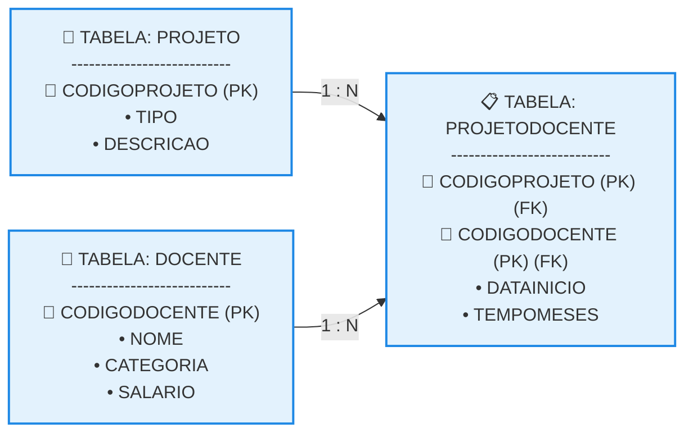

# Segunda Forma Normal (2FN)

## 1. O Conceito da 2FN e a Eliminação de Dependências Parciais

Uma tabela está na Segunda Forma Normal (2FN) se, e somente se, já estiver na 1FN e **nenhum atributo não chave depender parcialmente de qualquer chave primária composta**. Em suma, todos os atributos não chave devem possuir uma Dependência Funcional Total em relação à chave primária inteira. 

* **O Gatilho de Mudança:** Na 1FN, a tabela PROJETODOCENTE apresentava uma grave anomalia semântica: os campos NOME, CATEGORIA e SALARIO dependiam apenas de CODIGODOCENTE (uma parte da chave composta), gerando redundâncias massivas toda vez que um professor participava de mais de um projeto.
* **A Solução por Decomposição:** Para migrar o sistema para a 2FN, extraímos os atributos que sofriam dependência parcial e criamos uma nova tabela isolada para gerenciar os dados cadastrais dos professores.
* **A Nova Divisão de Papéis:** 

  * A tabela PROJETO permanece intacta, pois sua chave já era simples.
  * A tabela DOCENTE assume o cadastro exclusivo dos professores, usando CODIGODOCENTE como sua chave primária simples.
  * A tabela PROJETODOCENTE passa a atuar estritamente como uma tabela de relacionamento de muitos para muitos (N:M), mantendo apenas as chaves (CODIGOPROJETO, CODIGODOCENTE) e as propriedades que dependem verdadeiramente de ambas (DATAINICIO e TEMPOMESES).

## 2. Esquema Textual e Estrutura das Tabelas Físicas na 2FN

Abaixo está a declaração relacional e a amostragem dos dados reais em blocos de texto puro, garantindo a visualização alinhada das informações sem redundâncias cadastrais de professores. 

### Esquema Textual na 2FN

```text

PROJETO (CODIGOPROJETO, TIPO, DESCRICAO)

DOCENTE (CODIGODOCENTE, NOME, CATEGORIA, SALARIO)

PROJETODOCENTE (CODIGOPROJETO, CODIGODOCENTE, DATAINICIO, TEMPOMESES)
   CODIGOPROJETO REFERENCIA PROJETO
   CODIGODOCENTE REFERENCIA DOCENTE

```

### Tabelas do Banco de Dados Otimizadas

**Tabela: PROJETO** 

```text

CODIGOPROJETO (PK) | TIPO             | DESCRICAO
-------------------|------------------|--------------------------------------------------
PRODATA            | ANÁLISE DE DADOS | DESENVOLVIMENTO DE AMBIENTE PARA ANÁLISE DE DADOS
PROMED             | ANÁLISE CLÍNICA  | ATENDIMENTO COMUNITÁRIO E VACINAÇÃO

```

**Tabela: DOCENTE** 

```text

CODIGODOCENTE (PK) | NOME    | CATEGORIA | SALARIO
-------------------|---------|-----------|------------
DOC001             | JOSÉ    | ADJUNTO   | R$ 6000,00
DOC002             | LUCIANO | TITULAR   | R$ 16000,00
DOC003             | GILSON  | ADJUNTO   | R$ 6000,00
DOC004             | MARTA   | TITULAR   | R$ 16000,00
DOC010             | MARIA   | ADJUNTO   | R$ 6000,00

```

**Tabela: PROJETODOCENTE** 

```text

CODIGOPROJETO (PK)(FK) | CODIGODOCENTE (PK)(FK) | DATAINICIO | TEMPOMESES
-----------------------|------------------------|------------|-----------
PRODATA                | DOC001                 | 01/02/2019 | 16
PRODATA                | DOC002                 | 01/02/2020 | 4
PRODATA                | DOC003                 | 01/02/2019 | 16
PRODATA                | DOC004                 | 01/02/2020 | 4
PROMED                 | DOC001                 | 01/02/2019 | 16
PROMED                 | DOC010                 | 01/06/2020 | 0
PROMED                 | DOC004                 | 01/05/2020 | 1

```

## 3. Diagrama Lógico de Relacionamentos na 2FN

O fluxo horizontal abaixo exibe a nova arquitetura do banco de dados na 2FN. Note que a tabela PROJETODOCENTE agora funciona de forma limpa como a tabela associativa central que une os projetos aos seus respectivos docentes. 


