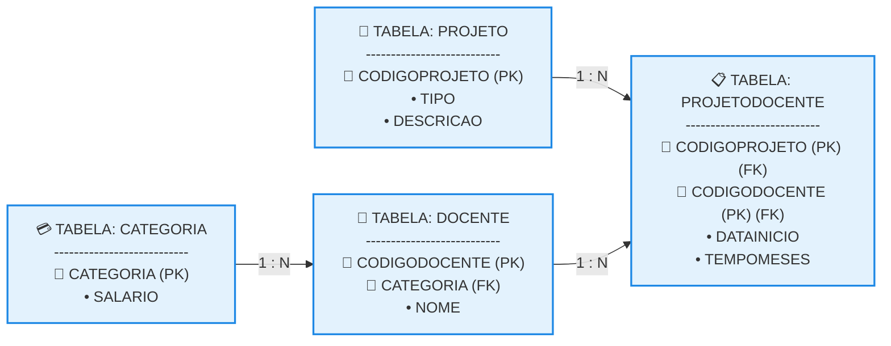

# Terceira Forma Normal (3FN)

## 1. O Conceito da 3FN e a Dependência Funcional Transitiva

Uma tabela está na Terceira Forma Normal (3FN) se ela já estiver na 2FN e **nenhum atributo não chave depender de forma transitiva da chave primária**. Em termos práticos, isso significa que uma coluna não chave não pode depender de outra coluna que também não seja chave. Todos os atributos devem depender direta e exclusivamente da chave primária da tabela. 

* **O Problema da Dependência Transitiva:** Ocorre quando existe uma relação de causa e efeito indireta do tipo A → B e B → C. Logo, A determina C por meio de B.
* **Mapeamento da Anomalia na Tabela DOCENTE:** Na etapa anterior, a tabela DOCENTE possuía a seguinte configuração de dependência: 

  * CODIGODOCENTE → CATEGORIA (O código do professor determina a sua categoria, ex: "ADJUNTO").
  * CATEGORIA → SALARIO (A categoria profissional determina de forma exata e fixa o salário base, ex: todo Adjunto ganha R$ 6.000,00 e todo Titular ganha R$ 16.000,00).
* **Análise Semântica:** O campo SALARIO possui uma dependência transitiva em relação à chave primária CODIGODOCENTE através da coluna CATEGORIA. Isso cria redundâncias graves, pois se a instituição tiver 500 professores "Adjuntos", o valor "R$ 6.000,00" será repetido 500 vezes desnecessariamente, gerando anomalias caso o piso salarial de uma categoria mude.

```text

Representação Matemática da Transitividade em DOCENTE (2FN):
CODIGODOCENTE → CATEGORIA
CATEGORIA → SALARIO [Dependência Transitiva] ⚠️

```

## 2. Solução por Decomposição e a Nova Tabela CATEGORIA

Para adequar o banco de dados às exigências da 3FN, removemos o atributo transitivo (SALARIO) da tabela de origem e criamos uma tabela de apoio específica para armazenar o plano de cargos e salários da instituição. 

* **A Estrutura de Suporte:** A nova tabela criada chama-se CATEGORIA, tendo o campo CATEGORIA como sua chave primária simples e o campo SALARIO como seu atributo dependente direto.
* **Ajuste na Tabela DOCENTE:** A coluna CATEGORIA permanece na tabela de professores, mas agora atuando estritamente como uma **Chave Estrangeira (FK)** que aponta para a nova tabela de cargos.
* **Preservação das Demais Tabelas:** As tabelas PROJETO e PROJETODOCENTE não possuíam dependências transitivas e permanecem inalteradas, herdando a estrutura consolidada na 2FN.

## 3. Esquema Textual Final e Estrutura das Tabelas na 3FN

Abaixo está a declaração relacional final e o espelho dos dados reais totalmente normalizados em formato de texto puro, eliminando qualquer tipo de redundância ou risco de inconsistência. 

### Esquema Textual Consolidado na 3FN

```text

PROJETO (CODIGOPROJETO, TIPO, DESCRICAO)

CATEGORIA (CATEGORIA, SALARIO)

DOCENTE (CODIGODOCENTE, NOME, CATEGORIA)
   CATEGORIA REFERENCIA CATEGORIA

PROJETODOCENTE (CODIGOPROJETO, CODIGODOCENTE, DATAINICIO, TEMPOMESES)
   CODIGOPROJETO REFERENCIA PROJETO
   CODIGODOCENTE REFERENCIA DOCENTE

```

### Tabelas Físicas do Banco de Dados Otimizado

**Tabela: PROJETO** 

```text

CODIGOPROJETO (PK) | TIPO             | DESCRICAO
-------------------|------------------|--------------------------------------------------
PRODATA            | ANÁLISE DE DADOS | DESENVOLVIMENTO DE AMBIENTE PARA ANÁLISE DE DADOS
PROMED             | ANÁLISE CLÍNICA  | ATENDIMENTO COMUNITÁRIO E VACINAÇÃO

```

**Tabela: CATEGORIA** 

```text

CATEGORIA (PK) | SALARIO
---------------|------------
ADJUNTO        | R$ 6000,00
TITULAR        | R$ 16000,00

```

**Tabela: DOCENTE** 

```text

CODIGODOCENTE (PK) | NOME    | CATEGORIA (FK)
-------------------|---------|---------------
DOC001             | JOSÉ    | ADJUNTO
DOC002             | LUCIANO | TITULAR
DOC003             | GILSON  | ADJUNTO
DOC004             | MARTA   | TITULAR
DOC010             | MARIA   | ADJUNTO

```

**Tabela: PROJETODOCENTE** 

```text

CODIGOPROJETO (PK)(FK) | CODIGODOCENTE (PK)(FK) | DATAINICIO | TEMPOMESES
-----------------------|------------------------|------------|-----------
PRODATA                | DOC001                 | 01/02/2019 | 16
PRODATA                | DOC002                 | 01/02/2020 | 4
PRODATA                | DOC003                 | 01/02/2019 | 16
PRODATA                | DOC004                 | 01/02/2020 | 4
PROMED                 | DOC001                 | 01/02/2019 | 16
PROMED                 | DOC010                 | 01/06/2020 | 0
PROMED                 | DOC004                 | 01/05/2020 | 1

```
## 4. Diagrama Lógico Geral do Banco de Dados Normalizado (3FN)

O mapa arquitetural a seguir consolida o ecossistema relacional na 3FN, ilustrando de forma clara o fluxo de chaves estrangeiras que garante a integridade referencial do sistema. 



Use o código com cuidado.
