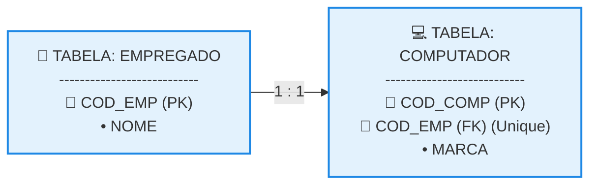
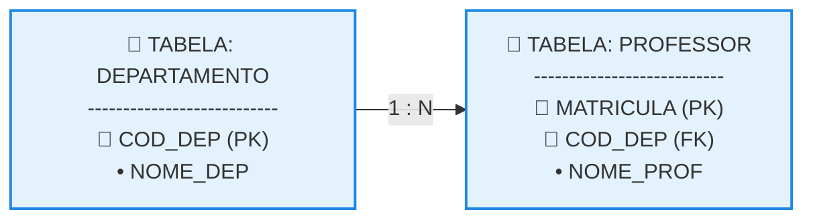
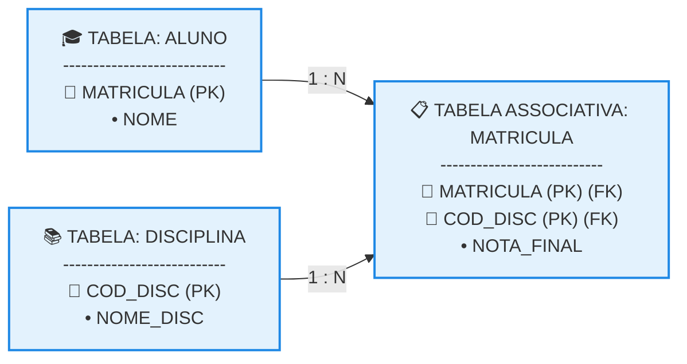
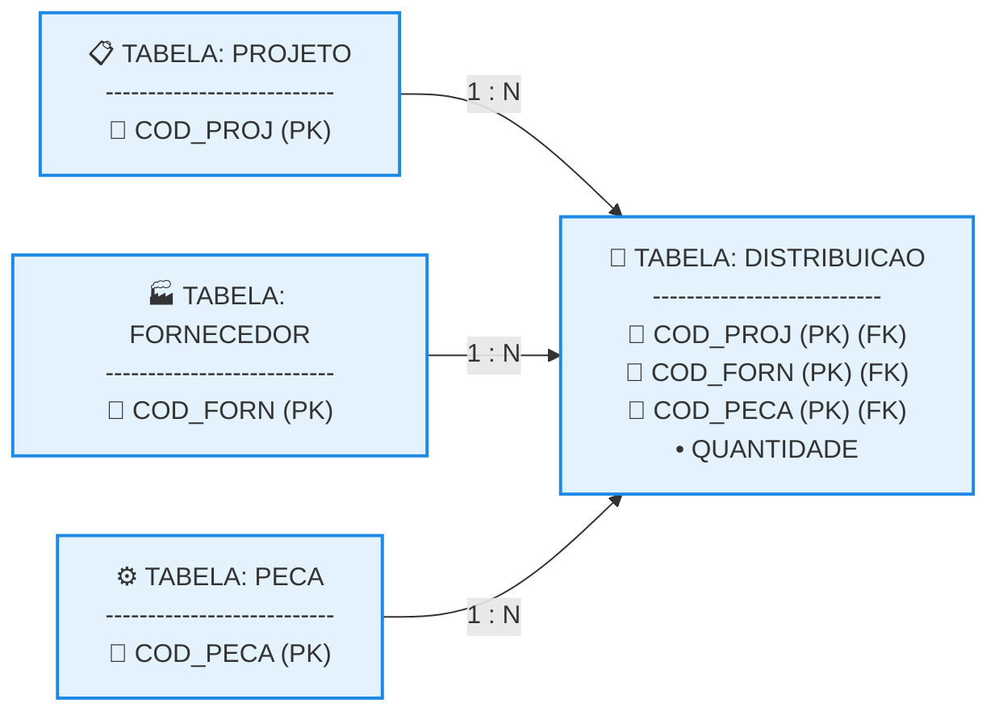

# Mapeamento de Relacionamentos

## 1. Mapeamento de Relacionamento 1:1 (Um para Um)

O mapeamento de associações binárias com cardinalidade 1:1 exige uma decisão de projeto baseada na participação das entidades. A regra padrão consiste em escolher uma das tabelas para receber a Chave Estrangeira (FK) apontando para a outra. 

* **Estratégia de Otimização:** Prioriza-se colocar a FK na tabela cuja participação seja obrigatória (cardinalidade mínima 1), mitigando a ocorrência de valores nulos (NULL).

### Organograma Lógico do Vínculo (1:1)



### Tabelas Lógicas Geradas (Texto Puro)

**Tabela: EMPREGADO** 

```text

COD_EMP (PK) | NOME
-------------|---------------
E01          | Carlos Alberto
E02          | Debora Silva

```

**Tabela: COMPUTADOR** 

```text

COD_COMP (PK) | COD_EMP (FK)(Unique) | MARCA
--------------|----------------------|------
C99           | E01                  | Dell
C100          | E02                  | Apple

```

* **Explicação Técnica:** A entidade COMPUTADOR foi eleita para armazenar o vínculo. A coluna COD_EMP atua como **Chave Estrangeira (FK)** direcionada à tabela pai. Adicionalmente, aplica-se uma restrição de **Unicidade (Unique)** sobre esta FK, garantindo fisicamente no SGBD que um funcionário não seja associado a mais de um computador.

## 2. Mapeamento de Relacionamento 1:N (Um para Muitos)

A cardinalidade 1:N representa o relacionamento mais comum em modelagem relacional. A regra de mapeamento é determinística: **a chave primária do lado "1" deve ser copiada para dentro da tabela do lado "N"**, atuando ali como uma Chave Estrangeira (FK). 

### Organograma Lógico do Vínculo (1:N)



### Tabelas Lógicas Geradas (Texto Puro)

**Tabela: DEPARTAMENTO** 

```text

COD_DEP (PK) | NOME_DEP
-------------|-----------------------
DEP-TI       | Tecnologia da Informacao
DEP-MAT      | Matematica

```

**Tabela: PROFESSOR** 

```text

MATRICULA (PK) | COD_DEP (FK) | NOME_PROF
---------------|--------------|-----------
202601         | DEP-TI       | Jose Maciel
202602         | DEP-TI       | Marta Souza
202603         | DEP-MAT      | Gilson Ramos

```

* **Explicação Técnica:** A tabela DEPARTAMENTO está no lado (1) e PROFESSOR reside no lado (N). Para implementar o vínculo, criamos a coluna COD_DEP na tabela PROFESSOR como **Chave Estrangeira (FK)**. Isso permite que o código do departamento se repita em várias linhas de professores, consolidando o fato de que um departamento possui muitos docentes.

## 3. Mapeamento de Relacionamento N:N (Muitos para Muitos)

Tabelas em ambiente relacional não suportam conexões diretas de muitos para muitos devido à proibição de atributos multivalorados em colunas. Portanto, um relacionamento N:N **obrigatoriamente gera uma nova tabela intermediária** (tabela associativa). 

### Organograma Lógico do Vínculo (N:N)



### Tabelas Lógicas Geradas (Texto Puro)

**Tabela: ALUNO** 

```text

MATRICULA (PK) | NOME
---------------|---------------
101            | Bruno Silva
102            | Viviane Silva

```

**Tabela: DISCIPLINA** 

```text

COD_DISC (PK) | NOME_DISC
--------------|--------------------
DISC-BD       | Banco de Dados
DISC-POO      | Programacao Objetos

```

**Tabela: MATRICULA (Tabela Associativa)** 

```text

MATRICULA (PK)(FK) | COD_DISC (PK)(FK) | NOTA_FINAL
-------------------|-------------------|-----------
101                | DISC-BD           | 9.5
101                | DISC-POO          | 8.0
102                | DISC-BD           | 10.0

```

* **Explicação Técnica:** A associação N:N deu origem à tabela MATRICULA. Sua **Chave Primária Composta** é formada pela junção de (MATRICULA, COD_DISC). Ambas as colunas atuam simultaneamente como Chaves Estrangeiras (FK) apontando para suas respectivas tabelas pai. Atributos da própria relação (como NOTA_FINAL) são armazenados nesta tabela intermediária.

## 4. Mapeamento de Relacionamento Ternário

Um relacionamento que envolve a associação simultânea de três entidades distintas segue a mesma lógica do modelo N:N, gerando obrigatoriamente uma **nova tabela associativa central** para consolidar o vínculo triplo. 

### Organograma Lógico do Vínculo Ternário



### Tabelas Lógicas Geradas (Texto Puro)

**Tabelas Pai (PROJETO, FORNECEDOR, PECA)** 

```text

PROJETO:    COD_PROJ (PK) [PRJ01, PRJ02]
FORNECEDOR: COD_FORN (PK) [FRN99, FRN88]
PECA:       COD_PECA (PK) [PCA55, PCA44]

```

**Tabela: DISTRIBUICAO (Tabela Associativa Ternária)** 

```text

COD_PROJ (PK)(FK) | COD_FORN (PK)(FK) | COD_PECA (PK)(FK) | QUANTIDADE
------------------|-------------------|-------------------|-----------
PRJ01             | FRN99             | PCA55             | 150
PRJ01             | FRN88             | PCA44             | 300
PRJ02             | FRN99             | PCA44             | 75

```

* **Explicação Técnica:** O relacionamento ternário resultou na criação da tabela associativa DISTRIBUICAO. A sua identificação exclusiva exige uma **Chave Primária Composta Tripla** formada pela combinação das três chaves estrangeiras: (COD_PROJ, COD_FORN, COD_PECA). Os dados operacionais unificados (como a QUANTIDADE de peças fornecidas para aquele projeto específico por aquele fornecedor determinado) residem nesta tabela intermediária.
