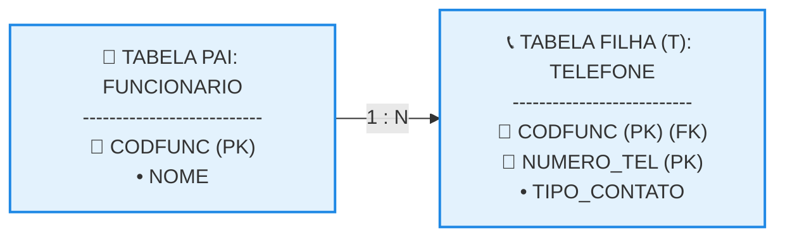

# Mapeamento de Atributos Multivalorados

## 1. Regras de Engenharia Lógica para Itens Multivalorados

Atributos multivalorados (aqueles que admitem uma lista ou múltiplos valores simultâneos para um mesmo registro, como vários números de telefone) violam frontalmente a Primeira Forma Normal (1FN) do modelo relacional, pois as colunas de uma tabela exigem valores estritamente atômicos e monovalorados. 

* **Roteiro de Resolução Técnica:** Para contornar essa restrição estrutural e mapear o dado de forma saudável no banco de dados, aplica-se um procedimento fixo composto por quatro passos mecânicos: 

  1. Criar uma nova tabela exclusiva (𝑇) para isolar o atributo multivalorado.
  2. Criar a coluna ou o conjunto de colunas correspondentes para receber os valores do atributo multivalorado dentro da tabela 𝑇.
  3. Adicionar na tabela 𝑇 uma coluna de **Chave Estrangeira (FK)** vinculada diretamente à chave primária da tabela original (tabela pai).
  4. Configurar a **Chave Primária Composta** da tabela 𝑇 por meio da junção entre a chave estrangeira criada no passo anterior e a coluna do próprio atributo multivalorado.

## 2. Organograma Lógico e Mapeamento do Vínculo

O diagrama abaixo ilustra a decomposição arquitetural de uma entidade que possui um dado multivalorado, demonstrando o surgimento da tabela filha de suporte estrutural e a amarração de suas chaves. 



## 3. Tabelas Lógicas Geradas e Amostragem de Dados

Abaixo estão expostos os esquemas textuais e a disposição física dos registros em formato de texto puro, evidenciando como a tabela filha gerencia as múltiplas ocorrências sem inflar ou repetir o cadastro principal do funcionário. 

### Esquema Textual do Mapeamento

```text

FUNCIONARIO (CODFUNC, NOME)

TELEFONE (CODFUNC, NUMERO_TEL, TIPO_CONTATO)
   CODFUNC REFERENCIA FUNCIONARIO

```

### Registros Físicos do Banco de Dados (Texto Puro)

**Tabela Original (Pai): FUNCIONARIO** 

```text

CODFUNC (PK) | NOME
-------------|-----------------
1001         | Jose Maciel
1002         | Amanda de Miranda

```

**Tabela de Atributo Multivalorado (T): TELEFONE** 

```text

CODFUNC (PK)(FK) | NUMERO_TEL (PK) | TIPO_CONTATO
-----------------|-----------------|-------------
1001             | 11999991111     | Celular
1001             | 1133334444     | Fixo Comercial
1002             | 21988882222     | Celular

```

## 4. Explicação Técnica do Processo Prático

A análise do comportamento dos registros nas tabelas acima consolida as diretrizes propostas pelo roteiro de modelagem: 

* **Isolamento de Redundância:** Em vez de criarmos colunas repetitivas e limitadas na tabela pai (como Telefone_1, Telefone_2), a criação da tabela filha 𝑇 (TELEFONE) permite que um funcionário cadastre uma quantidade ilimitada de números de forma dinâmica e limpa.
* **Mecânica da Chave Composta:** Na tabela TELEFONE, a coluna CODFUNC atua como Chave Estrangeira (FK). Para individualizar cada registro, a **Chave Primária Composta** une (CODFUNC, NUMERO_TEL).
* **Validação de Restrição:** Isolar apenas o código falharia porque travaria o funcionário 1001 a possuir apenas um telefone. Isolar apenas o número de telefone também falharia caso duas pessoas na mesma casa compartilhassem o mesmo telefone fixo. A combinação de ambos garante o critério de chave mínima e assegura que o mesmo funcionário não registre o mesmo número duas vezes na base.
