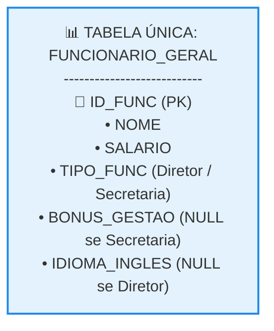
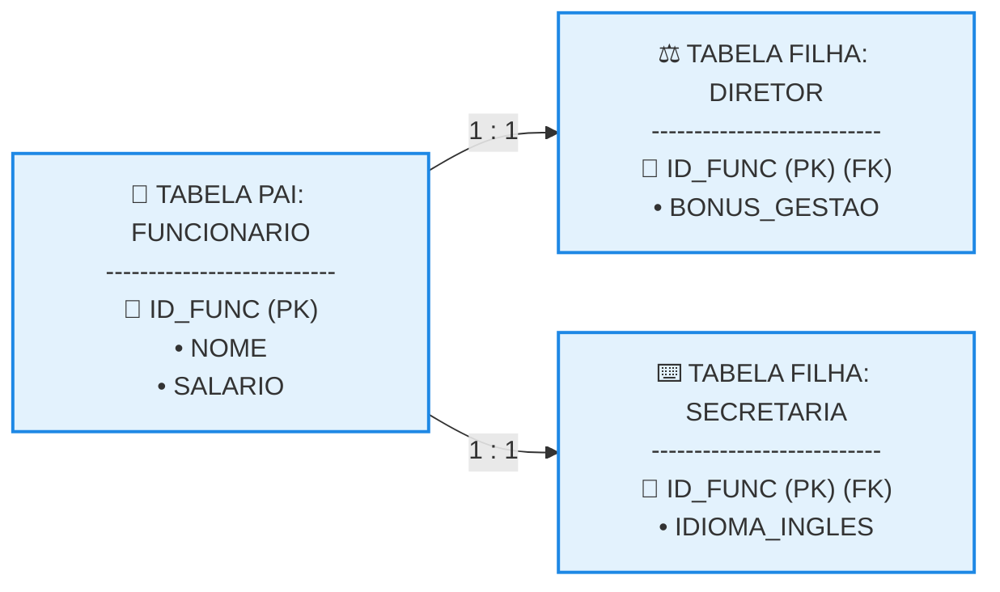
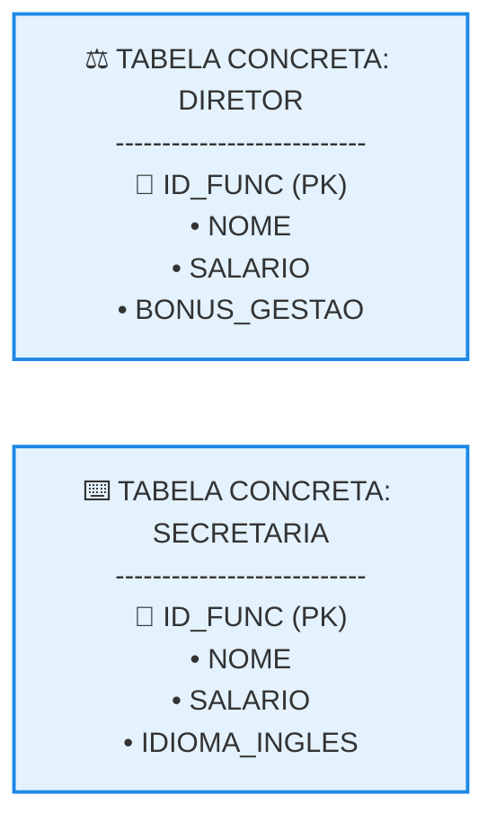

# Mapeamento de Especialização/Generalização

## 1. As Três Soluções Arquiteturais de Mapeamento

Mapear uma estrutura de especialização/generalização (supertipos e subtipos) para o modelo relacional representa um desafio de projeto, pois o conceito clássico de herança de orientação a objetos não existe de forma nativa nas tabelas. Para resolver essa transição, a engenharia de dados adota três soluções distintas, cada uma com seus próprios prós e contras (*trade-offs*): 

* **Solução 1: Tabela Única (Single Table / "Achatamento")** 

  * Cria-se uma única e exclusiva tabela contendo a junção de todos os atributos da entidade genérica e de todas as entidades especializadas de uma vez só.
  * *Vantagem:* Desempenho extremo para consultas, pois elimina a necessidade de junções (JOINs).
  * *Desvantagem:* Gera uma grande quantidade de campos nulos (NULL) para registros que não pertencem a determinado subtipo, além de violar restrições se o modelo não for exclusivo.
* **Solução 2: Uma tabela para cada entidade (Table per Class / Mapeamento Integral)** 

  * Cria-se uma tabela física para a entidade genérica e uma tabela física separada para cada uma das entidades especializadas da hierarquia.
  * *Vantagem:* Mantém a fidelidade conceitual completa do DER e elimina o desperdício de campos nulos.
  * *Desvantagem:* Exige a execução constante de JOINs entre a tabela pai e as tabelas filhas para recuperar os dados completos de um registro.
* **Solução 3: Subdivisão da entidade genérica (Table per Concrete Class / Eliminação do Pai)** 

  * Elimina-se a tabela genérica. Cria-se uma tabela para cada uma das entidades especializadas, onde cada tabela filha passa a conter, de forma duplicada, as colunas que pertenciam originalmente à entidade genérica.
  * *Vantagem:* Consultas diretas aos subtipos são rápidas e bem isoladas.
  * *Desvantagem:* Dificulta buscas globais (ex: listar todos os funcionários do sistema exige varrer e unir todas as tabelas filhas via UNION).

## 2. Cenário Conceitual Base para os Exemplos

Para ilustrar as três soluções de mapeamento, utilizaremos a hierarquia clássica de uma empresa onde FUNCIONARIO é o supertipo (entidade genérica) e possui duas especializações (subtipos): DIRETOR e SECRETARIA. 

* **Campos da Entidade Genérica:** ID_FUNC (Atributo Identificador), NOME e SALARIO.
* **Campo Exclusivo de DIRETOR:** BONUS_GESTAO.
* **Campo Exclusivo de SECRETARIA:** IDIOMA_INGLES.

## 3. Aplicação Prática das Três Soluções (Organogramas, Tabelas e Explicações)

### Solução 1: Tabela Única

Consolida toda a árvore hierárquica em um único bloco de armazenamento físico no banco de dados. 

### Organograma Lógico (Solução 1)



### Estrutura Física da Tabela (Texto Puro)

```text

ID_FUNC (PK) | NOME          | SALARIO    | TIPO_FUNC  | BONUS_GESTAO | IDIOMA_INGLES
-------------|---------------|------------|------------|--------------|--------------
101          | Carlos Alberto | R$ 15000,00 | DIRETOR    | R$ 5000,00   | NULL
102          | Debora Silva   | R$ 4500,00  | SECRETARIA | NULL         | Sim

```

* **Explicação Técnica:** Adiciona-se uma coluna de controle chamada TIPO_FUNC (discriminador) para ditar qual linha pertence a qual papel profissional. Note a presença obrigatória de valores NULL nos campos exclusivos do papel oposto, evidenciando o desperdício de colunas que caracteriza esta solução.

### Solução 2: Uma Tabela para Cada Entidade

Preserva a granularidade e o isolamento dos dados por meio de relacionamentos e chaves estrangeiras. 

### Organograma Lógico (Solução 2)



### Estrutura Física das Tabelas (Texto Puro)

```text

TABELA: FUNCIONARIO
ID_FUNC (PK) | NOME          | SALARIO
-------------|---------------|------------
101          | Carlos Alberto | R$ 15000,00
102          | Debora Silva   | R$ 4500,00

TABELA: DIRETOR
ID_FUNC (PK)(FK) | BONUS_GESTAO
-----------------|-------------
101              | R$ 5000,00

TABELA: SECRETARIA
ID_FUNC (PK)(FK) | IDIOMA_INGLES
-----------------|--------------
102              | Sim

```

* **Explicação Técnica:** As tabelas filhas DIRETOR e SECRETARIA não geram uma nova chave sequencial própria. A coluna ID_FUNC dentro delas atua de forma combinada como **Chave Primária e Chave Estrangeira (PK)(FK)** apontando de volta para o funcionário pai, configurando um vínculo um para um rígido que garante a herança lógica do modelo.

### Solução 3: Subdivisão da Entidade Genérica

Extingue a raiz comum e duplica as propriedades universais nas tabelas filhas concretas. 

### Organograma Lógico (Solução 3)



### Estrutura Física das Tabelas (Texto Puro)

```text

TABELA: DIRETOR
ID_FUNC (PK) | NOME          | SALARIO    | BONUS_GESTAO
-------------|---------------|------------|-------------
101          | Carlos Alberto | R$ 15000,00 | R$ 5000,00

TABELA: SECRETARIA
ID_FUNC (PK) | NOME          | SALARIO    | IDIOMA_INGLES
-------------|---------------|------------|--------------
102          | Debora Silva   | R$ 4500,00  | Sim

```

* **Explicação Técnica:** O supertipo FUNCIONARIO deixou de existir fisicamente no banco de dados. Os campos comuns NOME e SALARIO foram copiados e embutidos de maneira fixa dentro de cada subtipo. Esta estratégia remove a necessidade de junções nas buscas isoladas, mas quebra a integridade se um funcionário puder exercer os dois papéis simultaneamente (especialização compartilhada), sendo recomendada apenas para hierarquias estritamente exclusivas.
