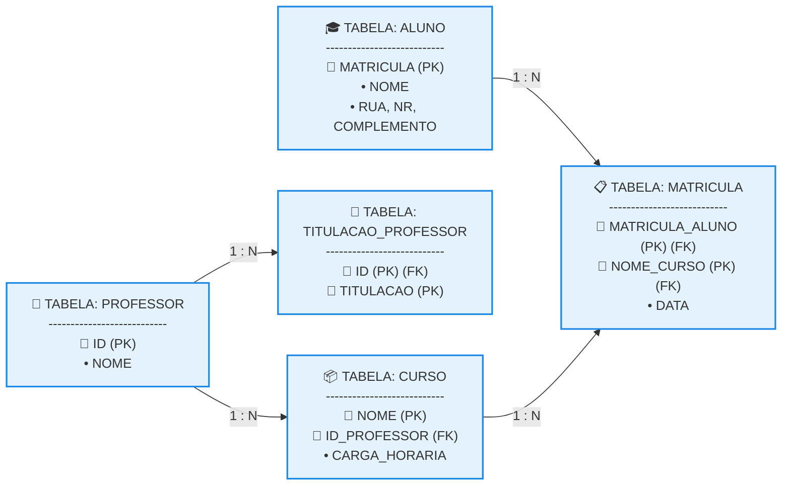

# Estudo de Caso de Mapeamento Conceitual-Lógico

## 1. Análise do DER e Aplicação do Roteiro de Prática

A conversão do Diagrama Entidade-Relacionamento para o modelo lógico relacional exige a execução sistemática e ordenada de um roteiro de dez passos técnicos, garantindo a integridade referencial e eliminando anomalias estruturais. 

* **Passo 1 a 4 (Mapeamento de Entidades e Chaves Primárias):** Identificamos três entidades fortes no diagrama, que dão origem direto a três tabelas principais: ALUNO (chave primária MATRICULA), CURSO (chave primária NOME) e PROFESSOR (chave primária ID).
* **Passo 5 (Tratamento de Atributo Composto):** O atributo composto ENDEREÇO da entidade ALUNO é completamente decomposto de forma atômica, transformando-se nas colunas RUA, NR e COMPLEMENTO dentro da própria tabela do aluno.
* **Passo 6 (Tratamento de Atributo Multivalorado):** O atributo multivalorado TITULACAO (0,n) conectado ao PROFESSOR viola a Primeira Forma Normal. Para corrigi-lo, extraímos esse dado gerando a nova tabela filha TITULACAO_PROFESSOR.
* **Passo 7 (Tratamento de Relacionamento N:N):** O vínculo MATRICULA entre ALUNO (0,n) e CURSO (1,n) possui cardinalidade máxima de muitos para muitos. Ele gera obrigatoriamente a tabela associativa MATRICULA, que herda o atributo próprio DATA.
* **Passo 8 (Tratamento de Relacionamento 1:N):** O vínculo LECIONA mapeia que um PROFESSOR (1,1) atua em vários CURSOS (0,n). Aplicando a regra, a chave primária ID do professor é migrada para dentro da tabela CURSO como uma Chave Estrangeira (FK).

## 2. Esquema Textual do Banco de Dados Gerado

Seguindo as convenções de engenharia de dados, abaixo está a declaração textual consolidada do esquema do banco de dados, onde as chaves primárias estão sublinhadas e as chaves estrangeiras explicitadas: 

```text

ALUNO (MATRICULA, NOME, RUA, NR, COMPLEMENTO)

PROFESSOR (ID, NOME)

TITULACAO_PROFESSOR (ID, TITULACAO)
   ID REFERENCIA PROFESSOR

CURSO (NOME, CARGA_HORARIA, ID_PROFESSOR)
   ID_PROFESSOR REFERENCIA PROFESSOR

MATRICULA (MATRICULA_ALUNO, NOME_CURSO, DATA)
   MATRICULA_ALUNO REFERENCIA ALUNO
   NOME_CURSO REFERENCIA CURSO

```

## 3. Estrutura Física das Tabelas Lógicas (Texto Puro)

Abaixo estão expostas as colunas e as amarrações de chaves estruturadas no padrão de texto puro, demonstrando a correta distribuição e atomicidade dos campos do seu estudo de caso: 

**Tabela: ALUNO** 

```text

MATRICULA (PK) | NOME                  | RUA         | NR  | COMPLEMENTO
---------------|-----------------------|-------------|-----|------------
101            | Carlos Alberto        | Rua A       | 10  | Apt 201
102            | Debora Silva          | Av B        | 500 | Casa

```

**Tabela: PROFESSOR** 

```text

ID (PK) | NOME
--------|-----------------
PRF01   | Sidney Nicolau
PRF02   | Nathielly Souza

```

**Tabela: TITULACAO_PROFESSOR (Atributo Multivalorado)** 

```text

ID (PK)(FK) | TITULACAO (PK)
------------|---------------
PRF01       | Mestre
PRF01       | Doutor
PRF02       | Especialista

```

**Tabela: CURSO** 

```text

NOME (PK)        | CARGA_HORARIA | ID_PROFESSOR (FK)
-----------------|---------------|------------------
Banco de Dados   | 80            | PRF01
Logica de Prog.  | 40            | PRF02

```

**Tabela: MATRICULA (Tabela Associativa N:M)** 

```text

MATRICULA_ALUNO (PK)(FK) | NOME_CURSO (PK)(FK) | DATA
-------------------------|---------------------|------------
101                      | Banco de Dados      | 24/08/2026
102                      | Banco de Dados      | 24/08/2026

```

## 4. Diagrama Lógico Geral do Mapeamento

O mapa arquitetural abaixo consolida graficamente a rede de tabelas e caminhos de chaves estrangeiras resultantes do mapeamento do DER da sua imagem: 


