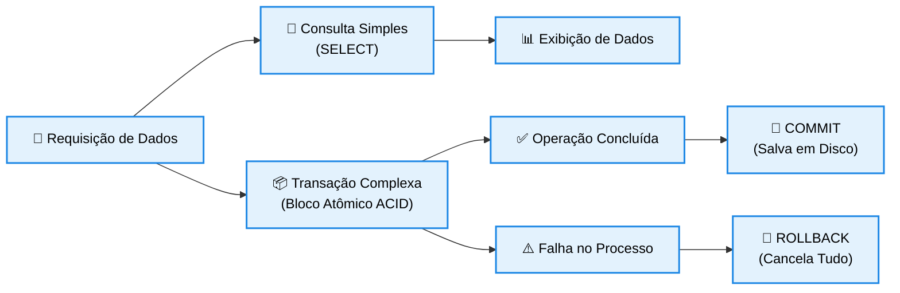

# Consultas e Transações em Banco de Dados

## 1. O Mecanismo de Consultas (DML / SELECT)

As consultas constituem a atividade mais frequente no ciclo de vida de um sistema de banco de dados, permitindo extrair e isolar informações estratégicas a partir de filtros e critérios lógicos bem definidos. 

* **Operação por Linguagem Comercial:** No modelo relacional, o processo de recuperação de dados é executado através dos comandos da **DML (Data Manipulation Language)**, tendo a instrução SELECT como o pilar central de desenvolvimento.
* **Flexibilidade na Recuperação:** Uma consulta permite projetar apenas as colunas de interesse, realizar junções lógicas entre múltiplas tabelas (JOINs), aplicar filtros condicionais complexos (WHERE), agrupar registros por categorias (GROUP BY) e ordenar os dados exibidos (ORDER BY).
* **Visões Virtuais (Views):** O sistema permite salvar estruturas de consultas complexas em disco sob a forma de tabelas virtuais denominadas *Views*. Elas simplificam o acesso aos dados para as equipes de desenvolvimento e aumentam a segurança, ocultando colunas sensíveis do banco original.

## 2. O Conceito e a Importância de Transações

Uma transação é caracterizada como uma unidade lógica de processamento de banco de dados que engloba um conjunto de uma ou mais instruções SQL lógicas (como INSERT, UPDATE ou DELETE) executadas como uma operação única e indivisível. 

* **O Princípio da Unidade:** O propósito de uma transação é garantir que todas as modificações contidas em seu bloco de código sejam salvas de forma permanente com sucesso ou, em caso de qualquer falha no meio do caminho, nenhuma delas seja aplicada no sistema.
* **O Caso Prático Clássico (Transferência Bancária):** 

  * Uma operação de transferência de dinheiro exige duas etapas consecutivas: subtrair o valor do saldo da Conta A (UPDATE) e, em seguida, somar esse mesmo valor ao saldo da Conta B (UPDATE).
  * Se o sistema sofrer uma queda de energia ou erro de rede logo após a primeira etapa, o dinheiro desapareceria da conta de origem sem chegar ao destino. A transação impede esse cenário catastrófico, cancelando todo o bloco e retornando o saldo original à Conta A.

## 3. As Propriedades ACID das Transações

Para certificar a estabilidade e o funcionamento correto de uma transação contra falhas de hardware ou concorrência de acessos simultâneos de usuários, o SGBD deve forçar rigorosamente quatro propriedades fundamentais conhecidas pela sigla **ACID**: 

* **A - Atomicidade:** A transação é tratada como um átomo (indivisível). É a regra do "tudo ou nada": ou a transação é totalmente concluída com sucesso (**Commit**) ou é totalmente desfeita e cancelada (**Rollback**).
* **C - Consistência:** A execução de uma transação deve levar o banco de dados de um estado válido e íntegro para outro estado igualmente válido, respeitando todas as regras, chaves e restrições de integridade mapeadas no projeto.
* **I - Isolamento:** Garante que os efeitos de uma transação em andamento não fiquem visíveis para outras transações simultâneas que estejam rodando no sistema, evitando que um usuário leia dados parciais ou inconsistentes.
* **D - Durabilidade (ou Persistência):** Garante que, uma vez que a transação foi concluída com sucesso (Commit), as alterações feitas por ela nos dados serão salvas permanentemente no disco físico do computador, sobrevivendo mesmo a falhas graves ou quedas do SGBD.

## 4. Diagrama Lógico de Ciclo de Vida de Consultas e Transações

O mapa de fluxo abaixo ilustra as ramificações de recuperação direta de consultas versus o fluxo de segurança do bloco atômico de uma transação, destacando os caminhos de confirmação ou descarte de dados. 

