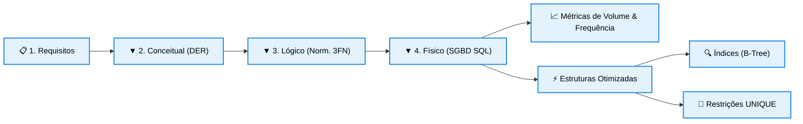

# Indexação e Consultas Envolvendo Mais de uma Tabela

## 1. Consultas Envolvendo Mais de uma Tabela (Junções Mecânicas)

À medida que o banco de dados é normalizado até a 3FN para eliminar redundâncias, as informações do minimundo acabam sendo fragmentadas e distribuídas por várias tabelas correlatas. A recuperação de dados integrados exige a execução de consultas acopladas. 

* **O Conceito de Junção (Join):** Consiste no processo lógico de reconstrução dos dados, unindo linhas de duas ou mais tabelas com base em uma condição de igualdade estabelecida entre suas chaves (Tabela_A.Chave_Primaria = Tabela_B.Chave_Estrangeira).
* **Mecânica de Processamento:** O motor do SGBD varre os índices das tabelas envolvidas procurando as correspondências e cruzando os registros. Se as chaves estrangeiras forem indexadas, essa operação ocorre em frações de segundo; caso contrário, o SGBD realiza uma varredura completa nas tabelas em disco (*Full Table Scan*), degradando severamente a performance do servidor.

## 2. Indexação em Banco de Dados: Arquitetura e Exemplo Prático

A indexação é uma estrutura de dados física auxiliar criada e gerenciada em disco pelo SGBD com o objetivo de acelerar drasticamente a velocidade de localização e recuperação dos registros nas consultas lógicas. 

* **Analogia Prática e Funcionamento:** Pense em um índice de banco de dados exatamente como o índice remissivo localizado no final de um livro técnico de 1.000 páginas. Se você deseja encontrar onde a palavra "Normalização" é citada, você não lê o livro página por página (Varredura Completa). Você vai ao índice remissivo (Índice), localiza a palavra ordenada alfabeticamente e salta diretamente para a página indicada (Ponteiro físico em disco).
* **Custos Ocultos (Trade-offs):** Embora acelerem as consultas (SELECT), os índices possuem desvantagens estruturais: 

  * Consumem espaço físico adicional de armazenamento em disco.
  * Reduzem a velocidade de operações de modificação de dados (INSERT, UPDATE e DELETE), pois a cada registro alterado, o SGBD é obrigado a pausar a operação e reordenar fisicamente a árvore de índices.

### Exemplo Prático Envolvendo Indexação

Considere a tabela ALUNO contendo 5.000.000 de registros cadastrados. As consultas corporativas filtram os dados frequentemente através da coluna CPF. 

* **Sem Índice:** Toda busca por um CPF específico exige que o SGBD leia as 5 milhões de linhas em disco sequencialmente até encontrar o registro, gerando gargalos massivos de hardware.
* **Com Índice:** Ao aplicar o comando CREATE INDEX idx_aluno_cpf ON ALUNO(CPF);, o SGBD cria uma estrutura em formato de Árvore B+ (B-Tree). A partir desse momento, qualquer busca por CPF exige no máximo de 3 a 4 leituras lógicas para localizar o ponteiro físico exato do aluno, reduzindo o tempo de resposta a zero.

## 3. Projeto Físico em Bancos de Dados Relacionais e Suas Etapas

Projetar um ecossistema de banco de dados corporativo é um processo disciplinado que avança progressivamente por quatro macroetapas bem definidas na engenharia de software: 

1. **Levantamento de Requisitos:** Entrevistas técnicas com os usuários e donos de negócio para descrever detalhadamente o minimundo e listar as regras operacionais da organização.
2. **Projeto Conceitual:** Construção do modelo abstrato de alto nível por meio do Diagrama Entidade-Relacionamento (DER), focando em blocos, losangos e atributos visuais, sem se preocupar com aspectos de software.
3. **Projeto Lógico:** Mapeamento conceitual-lógico que traduz o DER em esquemas relacionais de tabelas, definindo chaves primárias (PK), chaves estrangeiras (FK) e aplicando as regras de normalização (1FN, 2FN e 3FN).
4. **Projeto Físico:** É a conversão final do projeto lógico em scripts concretos de Linguagem SQL (DDL / DML) adaptados especificamente para a arquitetura do SGBD escolhido (MySQL, Oracle, PostgreSQL). Nesta fase, o engenheiro decide as configurações de infraestrutura de baixo nível para acomodar a carga de trabalho.

## 4. Parâmetros Críticos de Configuração do Projeto Físico

A consolidação de um projeto físico de alto desempenho exige que o projetista documente e analise quatro métricas operacionais que determinam a estrutura física das tabelas no SGBD: 

* **Frequência de Chamada de Consultas e Transações Esperada:** Identifica quantas vezes determinada pesquisa ou bloco transacional é acionado em um período (ex: 5.000 conexões por minuto). Consultas extremamente frequentes demandam a criação de índices dedicados nativos na memória ou tabelas clusterizadas.
* **Restrições de Tempo de Consulta e Transações:** Mapeia os requisitos de tempo máximo tolerado de resposta (*SLA*). Se o fechamento financeiro exige que uma transação dure menos de 2 segundos, o projeto físico deve otimizar os caminhos físicos dos dados de gravação.
* **Frequências Esperadas de Operações de Atualização:** Avalia a taxa de mutação dos dados (INSERT/UPDATE/DELETE). Uma tabela com altíssima taxa de escrita e pouca leitura (ex: logs de auditoria) deve possuir o mínimo de índices possível, evitando travar as inserções.
* **Restrições de Exclusividade em Colunas da Tabela:** Define quais colunas não chave exigem a restrição física de unicidade absoluta na base de dados (UNIQUE CONSTRAINT). Ao declarar um campo como único (ex: a coluna CPF ou EMAIL), o próprio SGBD cria automaticamente um índice exclusivo por trás do pano para validar a integridade sem duplicar os dados.

## 5. Diagrama de Transição e Componentes do Projeto Físico

O organograma horizontal abaixo ilustra as fases de processamento desde as etapas de engenharia inicial até a determinação das diretrizes físicas e estruturas auxiliares no SGBD. 

