# Guia Tecnico de Instalacao e Configuracao do PostgreSQL

## 1. Instalacao do PostgreSQL no Windows

* Acesse o site oficial da comunidade em postgresql.org.
* Baixe o instalador da versao compativel com Windows.
* Execute o arquivo binario para iniciar o assistente.
* Defina a senha do superusuario padrao denominado postgres.
* Mantenha a porta padrao de comunicacao configurada como 5432.
* Prossiga ate o termino do assistente de instalacao.
* Realize a instalacao do utilitario de administracao PgAdmin4.

## 2. Fluxo de Geracao e Execucao do Banco de Dados

```mermaid

graph LR
    A[brModelo3] -->|Gerar Modelo Fisico| B[Salvar criadoc.sql]
    B -->|Carregar Script| C[pgAdmin4]
    C -->|Criar Banco documentos| D[Executar Queries]
    D -->|Popular Dados| E[Executar populadoc.sql]

    style A fill:#e3f2fd,stroke:#1e88e5,stroke-width:2px,color:#000
    style B fill:#e3f2fd,stroke:#1e88e5,stroke-width:2px,color:#000
    style C fill:#e3f2fd,stroke:#1e88e5,stroke-width:2px,color:#000
    style D fill:#e3f2fd,stroke:#1e88e5,stroke-width:2px,color:#000
    style E fill:#e3f2fd,stroke:#1e88e5,stroke-width:2px,color:#000

```



## 3. Configuracao de Parametros do Cluster

```text

Parametro              Valor Padrao        Descricao
Porta                  5432                Porta nativa de escuta TCP/IP
Superusuario           postgres            Nome do administrador principal do SGBD
Banco de Dados         documentos          Nome da database criada para a pratica
Script de Estrutura    criadoc.sql         DDL de criacao das tabelas estruturais
Script de Carga        populadoc.sql       DML de insercao dos dados iniciais

```

## 4. Criacao do Banco de Dados e Carga de Tabelas

* Inicie o pgAdmin4 e conecte ao servidor local ativo.
* Clique com o botao direito em Databases e selecione Create Database.
* Atribua exatamente o nome documentos ao novo banco de dados.
* Abra a ferramenta Query Tool na interface do banco criado.
* Copie e cole o conteudo do arquivo estrutural criadoc.sql.
* Execute o comando para consolidar a criacao das tabelas fisicas.
* Verifique a criacao correta navegando pelo menu de Tabelas.
* Abra nova Query Tool para rodar o arquivo de carga populadoc.sql.
