# Pratica de Consultas Envolvendo Mais de uma Tabela e Indexacao

Vamos complementar nosso banco de documentos com a criacao de mais duas tabelas. Alem disso, vamos analisar o uso de indices e como eles podem melhorar as consultas SQL. Neste video, voce vai praticar consultas envolvendo mais de uma tabela e indexacao. 

## 1. Instalacao do PostgreSQL no Windows

* Acesse o site oficial da comunidade em postgresql.org.
* Baixe o instalador da versao compativel com Windows.
* Execute o arquivo binario para iniciar o assistente.
* Defina a senha do superusuario padrao denominado postgres.
* Mantenha a porta padrao de comunicacao configurada como 5432.
* Prossiga ate o termino do assistente de instalacao.
* Realize a instalacao do utilitario de administracao PgAdmin4.

## 2. Fluxo de Carga e Otimizacao do Banco

```mermaid

graph LR
    A[criadoc.sql] -->|Estrutura Inicial| B[populadoc.sql]
    B -->|Dados Iniciais| C[criapopdespachos.sql]
    C -->|Novas Tabelas| D[Analise de Consultas]
    D -->|Otimizacao| E[Criacao de Indice]

    style A fill:#e3f2fd,stroke:#1e88e5,stroke-width:2px,color:#000
    style B fill:#e3f2fd,stroke:#1e88e5,stroke-width:2px,color:#000
    style C fill:#e3f2fd,stroke:#1e88e5,stroke-width:2px,color:#000
    style D fill:#e3f2fd,stroke:#1e88e5,stroke-width:2px,color:#000
    style E fill:#e3f2fd,stroke:#1e88e5,stroke-width:2px,color:#000

```



## 3. Estrutura de Tabelas do Banco de Dados

```text

Tabela             Tipo de Conteudo            Relacionamento Principal
documento          Dados de identificacao      Chave primaria para despachos
tipo_documento     Categorizacao de arquivos   Vinculo com tabela documento
despacho           Tramitacoes e historico     Chave estrangeira de documento
tipo_despacho      Categorizacao de acoes      Vinculo com tabela despacho

```

## 4. Execucao de Scripts e Carga Complementar

* Abra o pgAdmin4 e realize a conexao no servidor local configurado.
* Selecione o banco de dados chamado documentos criado previamente.
* Abra uma nova janela de consulta utilizando a ferramenta Query Tool.
* Carregue e execute o script criadoc.sql para erguer a estrutura basica.
* Execute o script populadoc.sql para realizar a primeira carga de dados.
* Abra nova Query Tool para rodar o arquivo criapopdespachos.sql.
* Valide a presenca das tabelas despacho e documento na aba Tables.

## 5. Analise e Implementacao de Indices

* Execute uma consulta filtrando a tabela despacho por um documento especifico.
* Utilize a clausula EXPLAIN ANALYZE para registrar o tempo de execucao.
* Construa uma query de juncao JOIN entre as tabelas documento e despacho.
* Registre o plano de execucao e o custo computacional da juncao efetuada.
* Execute o comando CREATE INDEX para a coluna documento da tabela despacho.
* Rode novamente as consultas de selecao e juncao executadas anteriormente.
* Compare os tempos de resposta finais para validar o ganho de performance.
