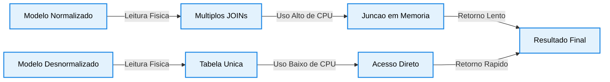

# Desnormalizar para Ganhar Desempenho

A desnormalização é o processo de adicionar dados redundantes ou agrupar dados intencionalmente em um banco de dados já normalizado. 
O objetivo principal é otimizar o desempenho de leitura de consultas complexas, eliminando a sobrecarga causada por junções frequentes de tabelas.

## 1. Fundamentos e Decisão de Arquitetura

- Reduz a complexidade de execução ao transformar buscas multi-tabela em consultas simples.
- Sacrifica a eficiência de escrita para maximizar a velocidade de recuperação de dados.
- Aumenta o consumo de espaço em disco devido ao armazenamento de registros duplicados.
- Adequa-se a cenários de Business Intelligence, Data Warehouses e arquiteturas OLAP.
- Apresenta viabilidade técnica quando a taxa de leitura supera massivamente as operações de escrita.
- Transfere a responsabilidade de consistência dos dados para a aplicação ou para regras internas do SGBD.

## 2. Fluxo de Execução Comparativo



## 3. Matriz de Impacto de Modelagem

```text
Atributo Tecnico       Abordagem Normalizada        Abordagem Desnormalizada
Estrutura Lógica       Entidades isoladas por Fn    Campos replicados e agrupados
Operacao de SELECT     Exige juncoes estruturais    Acessa registros diretamente
Operacao de UPDATE     Rapida e em local unico      Lenta (Propagacao em cascata)
Risco de Inconsistencia Teoricamente nulo           Elevado (Requer manutencao)
Uso de Cache e RAM     Alto consumo em agregacoes   Baixo consumo (Dados prontos)

```

## 4. Estratégias Práticas no PostgreSQL

- Duplicação de Atributos: Inclusão de colunas de tabelas de domínio diretamente na tabela operacional de histórico.
- Views Materializadas: Armazenamento em disco do resultado de queries complexas com atualização via comando de refresh.
- Tabelas de Agregação: Criação de estruturas específicas para guardar totais e contadores pré-calculados.
- Gatilhos Automatizados: Uso de Triggers em PL/pgSQL para atualizar os campos redundantes após eventos de escrita.
